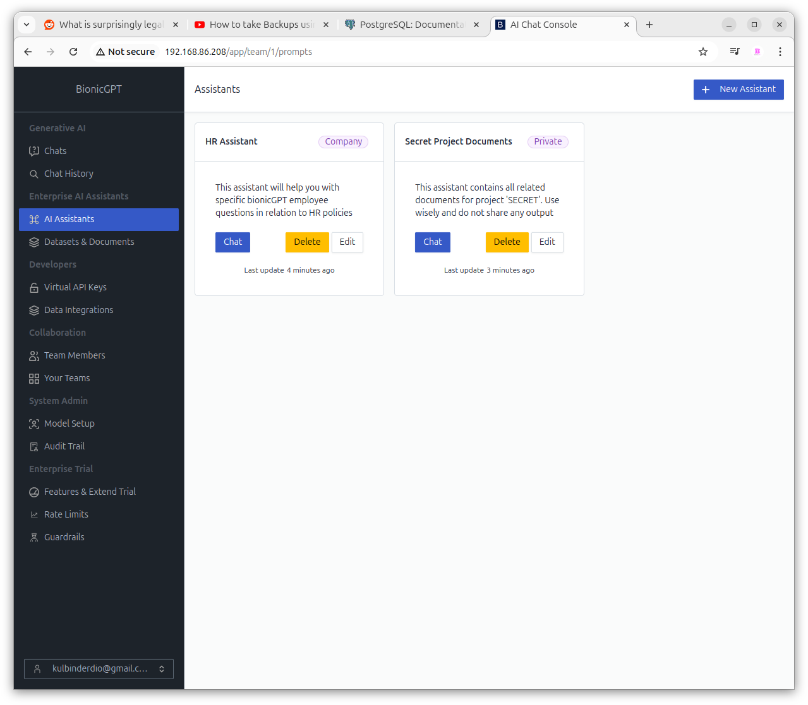
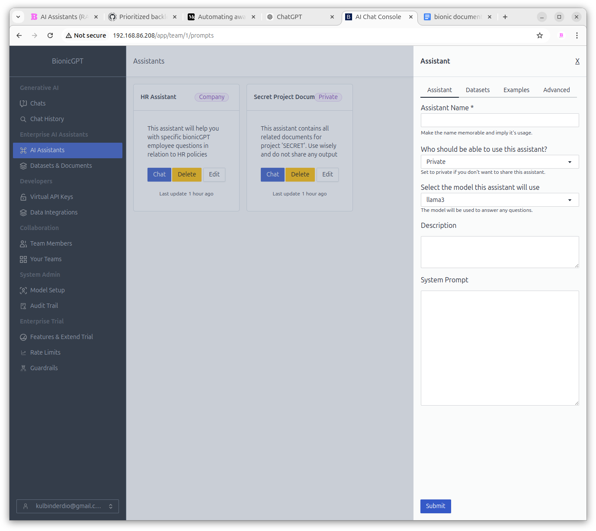
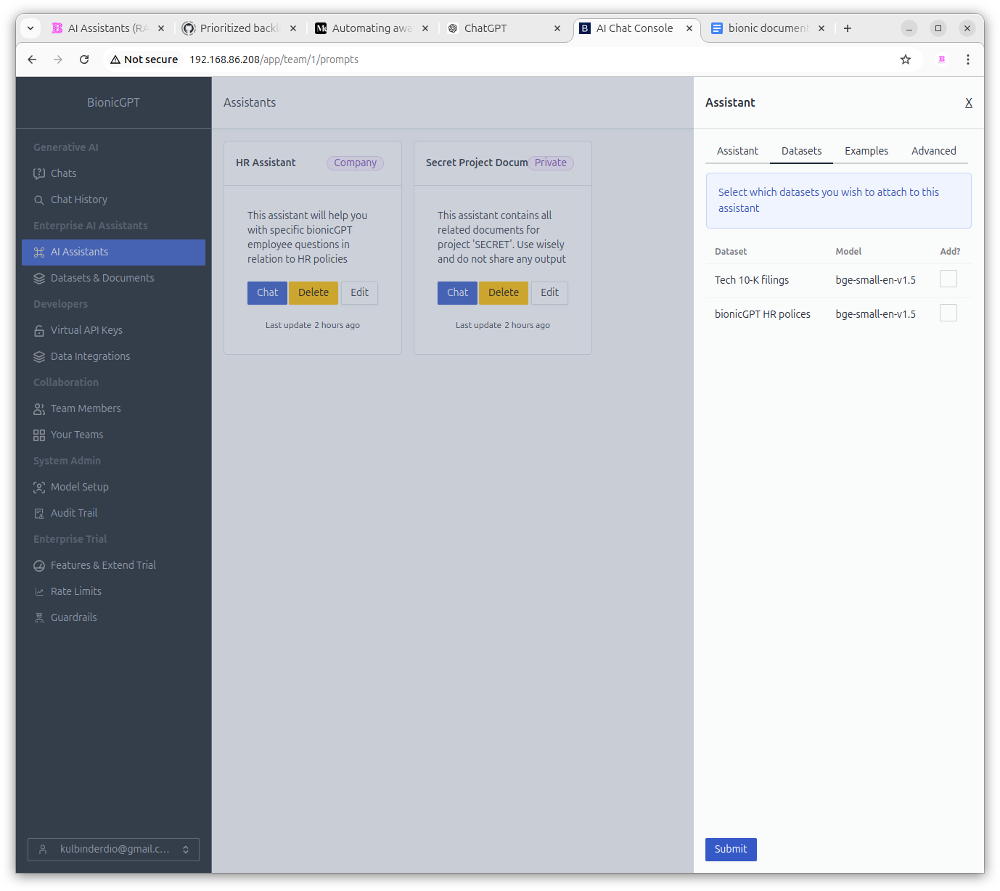
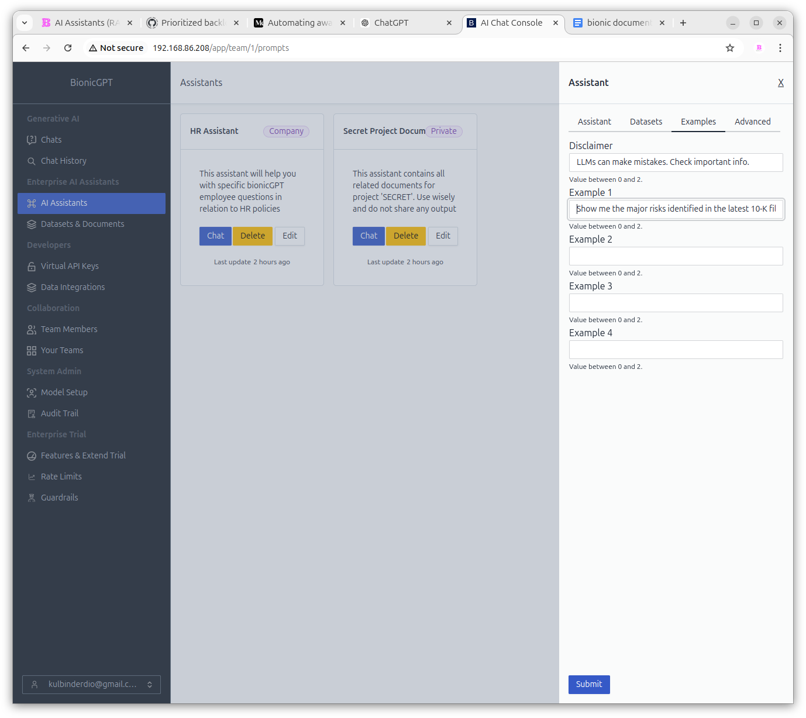
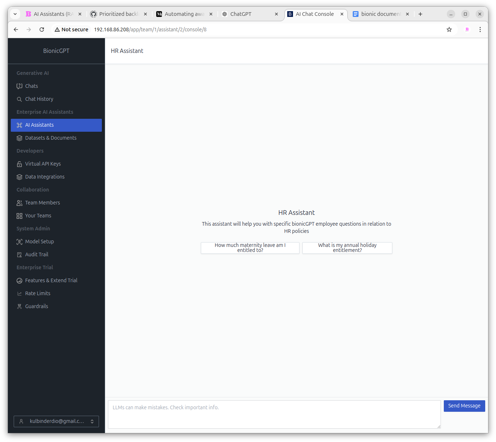
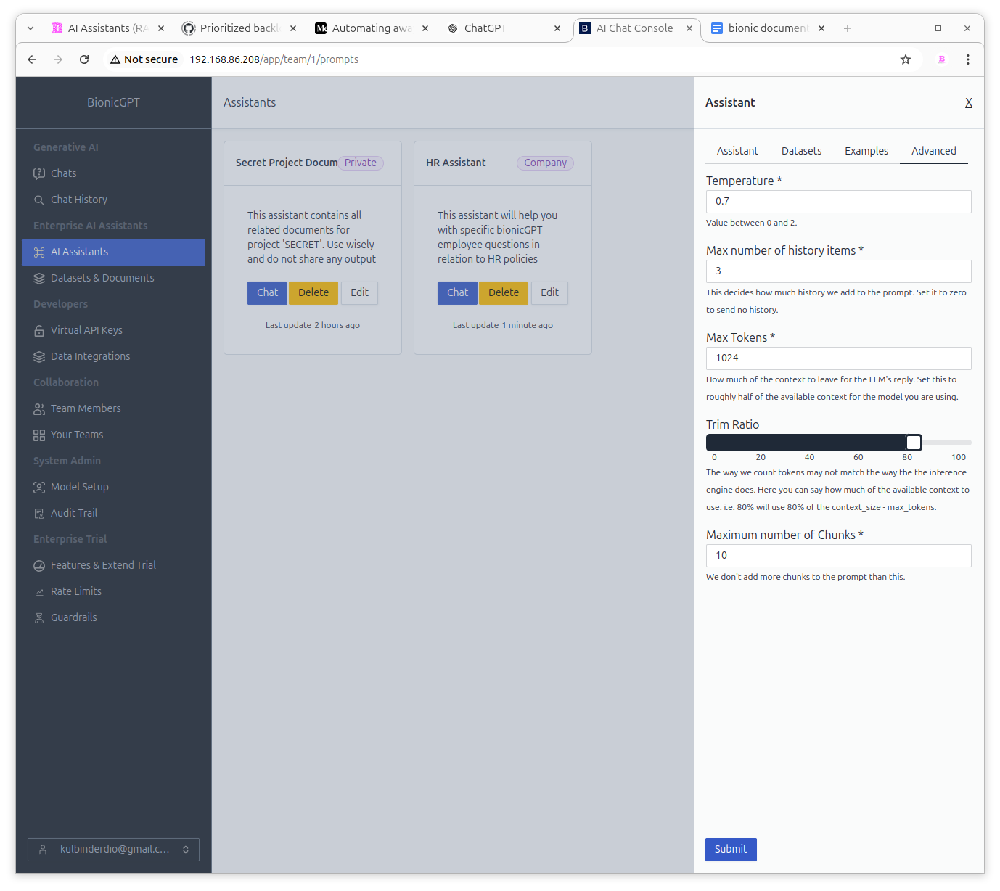

# AI Assistants

An AI Assistant enables you to create a customised version of a large language model tailored to your specific needs. You can define a "system prompt" that guides how the model should respond to user inputs. Additionally, you can associate uploaded documents (RAG) with the AI Assistant to enhance its responses with relevant data.

For instance, if you want to create a company-specific Human Resources chatbot, you would set the system prompt to reflect its HR focus and link it to a dataset of your company’s HR documents. Any user query directed at this AI Assistant would then draw on this additional data to provide accurate and context-specific responses.

Clicking on the Chat button for any AI Assistant will open a chat session with the system prompt and with any associated documents as additional input.

## Creating an AI Assistant

Clicking the New Assistant button will show the window displayed on the right of the screen

### Assistant Tab
1. **Assistant Name** - Pick a relevant name. This will be display in the Assiatmt card.

2. **Who should be able to use this assistant?** - Assistants make use of a permissioning model where you can decide who has access to your assistant. A Private Assistant is only available to the user that created it. A **Team** Assistant is available for anyone in the same team as the creator and the **Company** assistant is available to anyone that has an account on the system.

3. **Model** - The mode that will be used for inference

4. **Description** - This description will be displayed in the Assistant card. Make it something that details exactly what the Assistant has been created to do.
Example : This assistant has been preloaded with the latest 10-K filing for the largest 10 tech companies in the US and will answer questions based on their content

5. **System Prompt** - THis is used to direct the intent of the Assistant. It should be written in a manner that directs exactly how you would like user prompts answered.
Example : You are a financial analyst specialising in the US technology sector. You have access to the 10-K filings of these companies. Use the data available to you in the prompt to answer any specific user question about the information appearing in these documents. If you do not know the answer say so.

### Datasets Tab

This tab allows you to associate Datasets with this Assistant.
See xxxx for further information on Datasets

### Examples Tab

This tab allows you to set up a number of example user prompts.
This will aid the user in the use of this assistant. These are displayed when a user clicks on the Assistant Chat button

### Advanced Tab

1. **Temperature** - the temperature is a parameter that controls the randomness of the output, with lower values leading to more focused and deterministic responses, and higher values producing more diverse and creative responses.

2. **Max Number of History Items** - defines how many previous chat messages from your session are included with the latest request, allowing the model to understand the context of your conversation.

3. **Max Tokens** - determines how much of the context window is reserved for the model's response. For smaller context windows, it's recommended to set this to half the size of the model's context window.

4. **Trim Ration** - the way bionicGPT counts tokens may not match the way the inference engine does. Here you can say how much of the available context to use. i.e. 80% will use 80% of the context_size - max_tokens.

5. **Maximum number of Chunks** - when a dataset(s) is associated, the user prompt is used to retrieve semantically similar information from the dataset(s). This information, along with the user prompt, is then sent to the model to generate a response. This parameter lets you define the number of "similar" chunks of information to be returned, with a default of 10. The chunks are provided in order of similarity.

