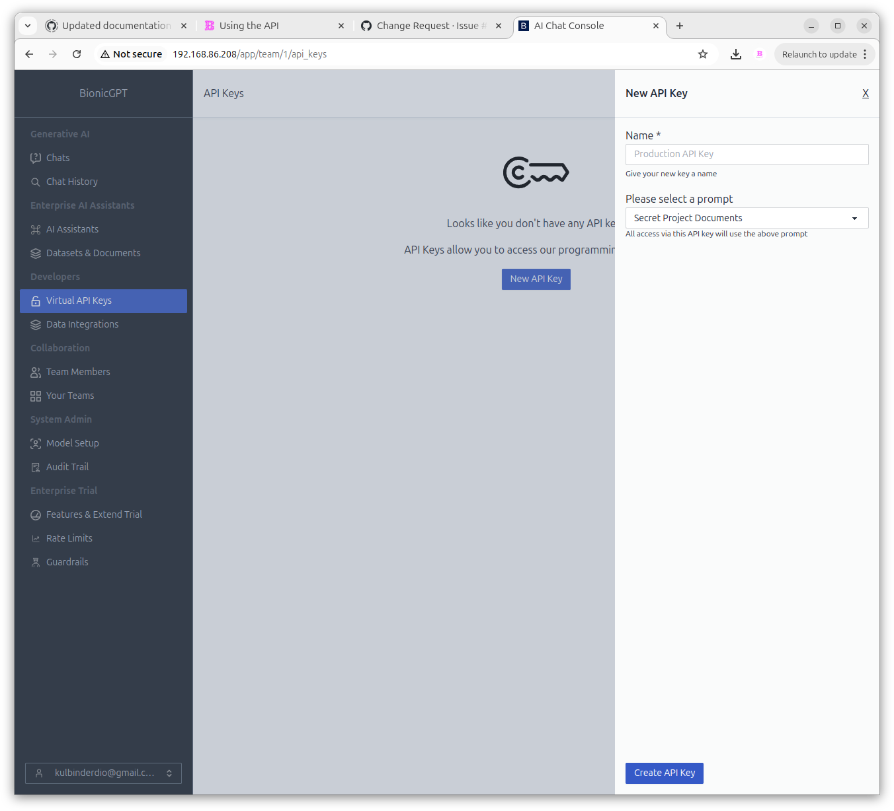

# Using the API

In order to use the API you must obtain a key first




Here we assume you have BionicGPT running locally, you'll need to change all references from `localhost` to the domain your using for production.

## View all Models

```sh
curl -H "Authorization: Bearer $BIONIC_API_KEY" http://localhost/v1/models
#{"object":"list","data":[{"id":"text-embedding-ada-002","object":"model"},{"id":"ggml-gpt4all-j","object":"model"}]}
```

## Completions

```sh
curl http://localhost/v1/chat/completions
-H "Content-Type: application/json"
-H "Authorization: Bearer $BIONIC_API_KEY"
-d '{
     "model": "ggml-gpt4all-j",
     "messages": [{"role": "user", "content": "Say this is a test!"}],
     "temperature": 0.7,
     "stream:" true
   }'
#{"object":"chat.completion","model":"ggml-gpt4all-j","choices":[{"index":0,"finish_reason":"stop","message":{"role":"assistant","content":"I'm sorry, I don't understand what you mean. Can you please provide more context or clarify your statement?"}}],"usage":{"prompt_tokens":0,"completion_tokens":0,"total_tokens":0}}
```

## Embeddings

```sh
curl http://localhost/v1/chat/completions
-H "Content-Type: application/json"
-H "Authorization: Bearer $BIONIC_API_KEY"
-d '{
     "model": "ggml-gpt4all-j",
     "messages": [{"role": "user", "content": "Say this is a test!"}],
     "temperature": 0.7
   }'
#{"object":"chat.completion","model":"ggml-gpt4all-j","choices":[{"index":0,"finish_reason":"stop","message":{"role":"assistant","content":"I'm sorry, I don't understand what you mean. Can you please provide more context or clarify your statement?"}}],"usage":{"prompt_tokens":0,"completion_tokens":0,"total_tokens":0}}
```