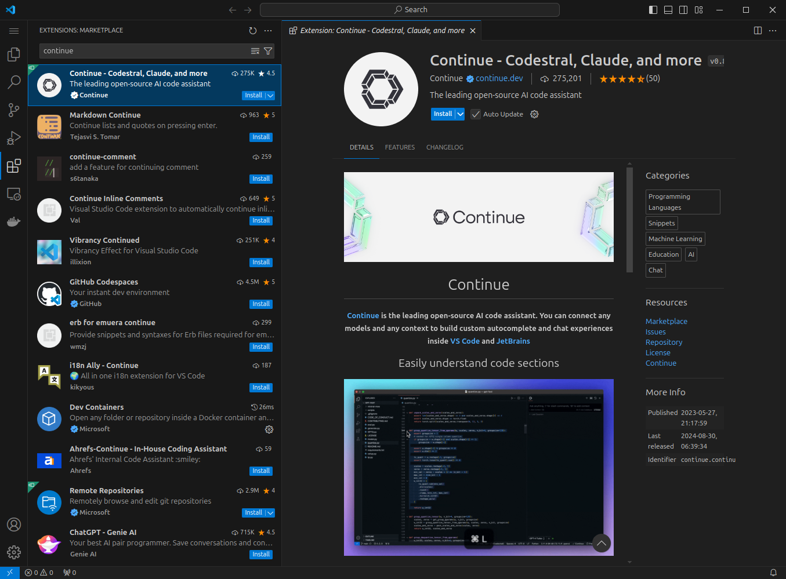
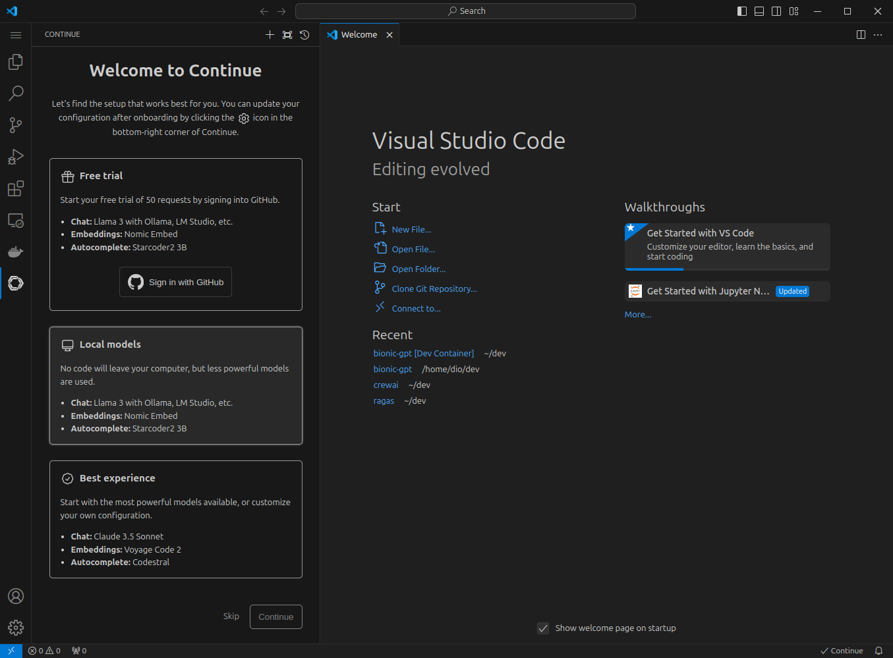
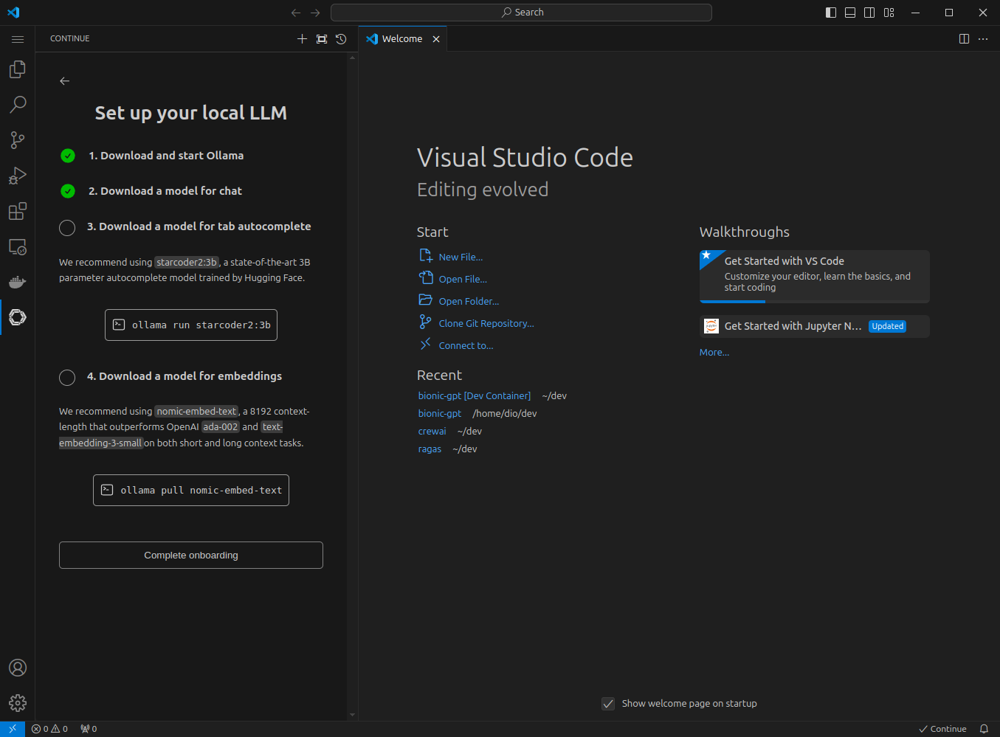
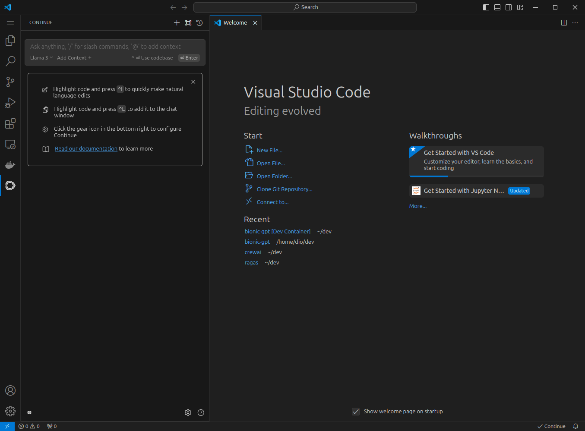
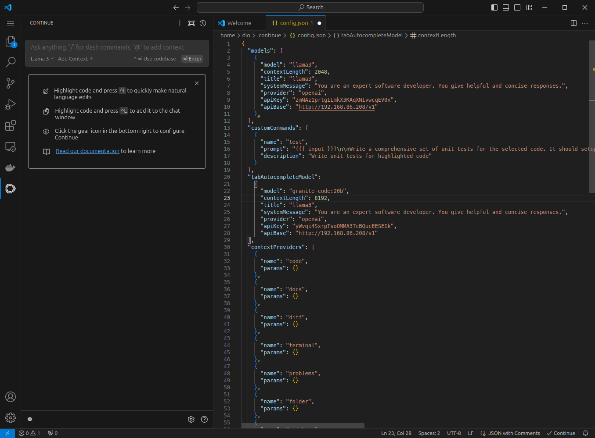
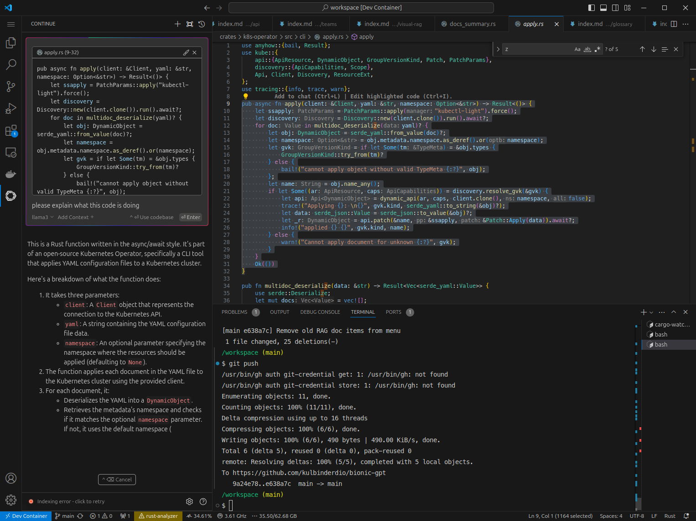

# Your Private Coding CoPilot

This guide will use the open source [Continue](https://github.com/continuedev/continue) Visual Studio Code extension configured to work with **bionicGPT**

1. **Install Continue extension**



2. **Configure Extension**









5. **Config File Setup**



You will find the config file in your home directory under `.continue/config.json`
Open this file and update to your own settings, see example below

```
{
      "model": "granite-code:20b",
      "contextLength": 8192,
      "title": "granite-code",
      "systemMessage": "You are an expert software developer. You give helpful and concise responses.",
      "provider": "openai",
      "apiKey": "yWvqi4SxrpTsoOMMA3TcBQucEESEIk",
      "apiBase": "http://192.168.86.208/v1"
    },
```

6. **Usage Example**



