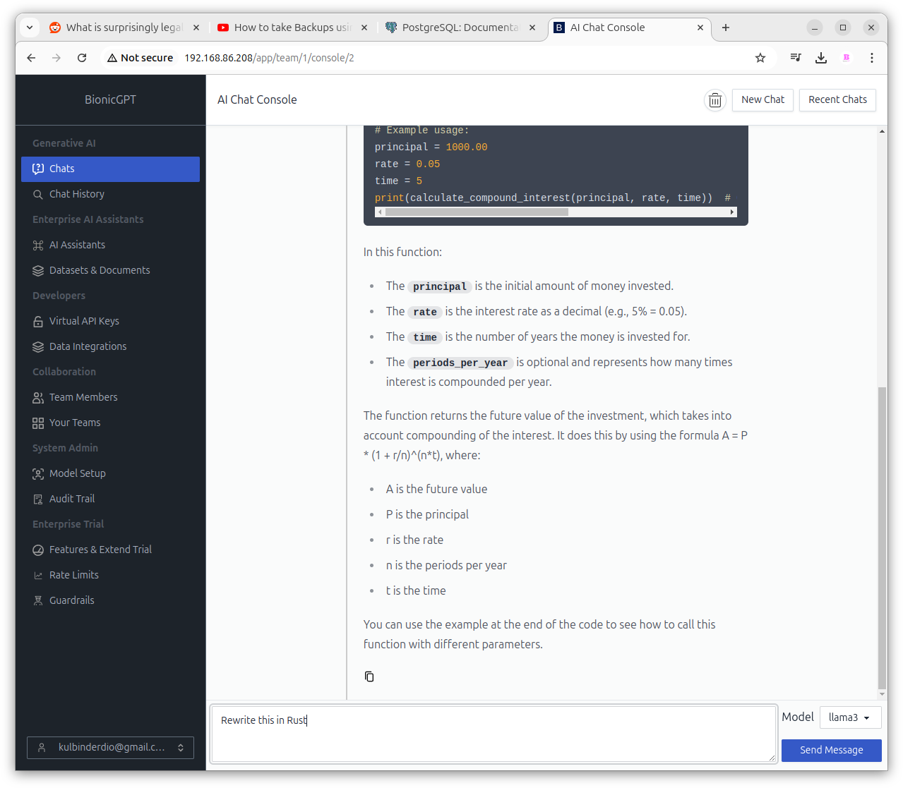
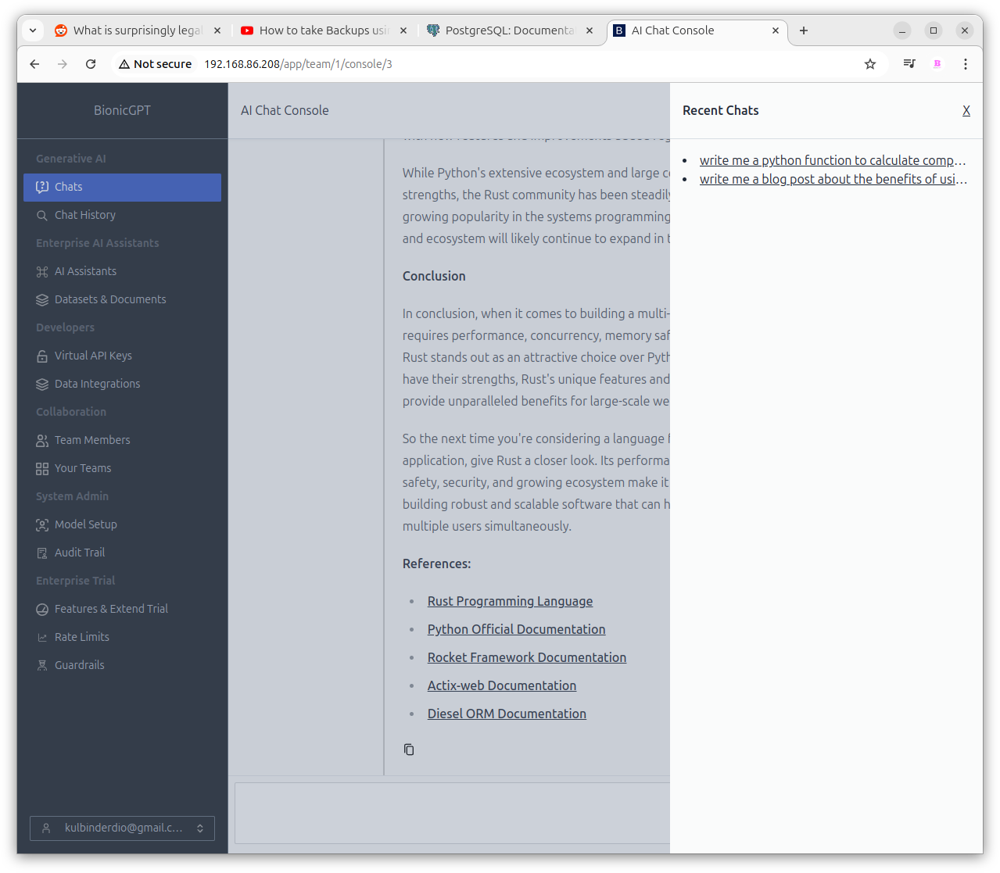
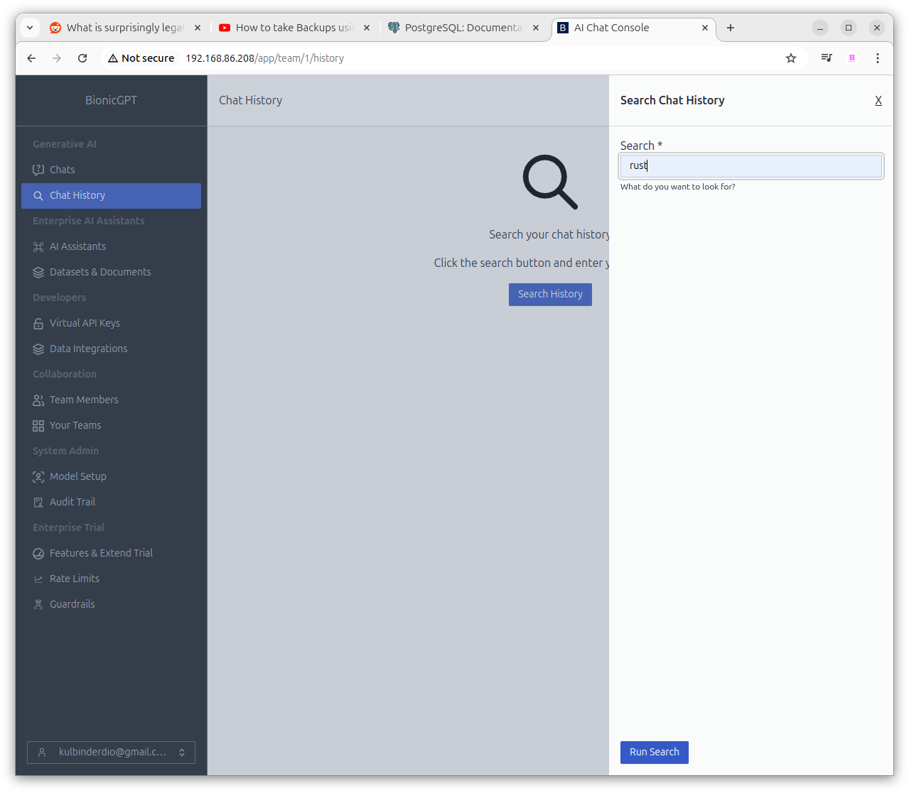
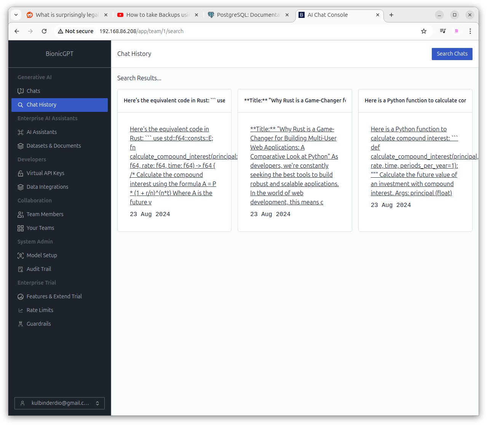

# The Console

Chat Main Features:
1. **Model Selection:**
At the bottom-right corner of the screen, you will find a dropdown menu labelled "Model." This allows you to select from pre-configured AI models. The choice of model determines the nature of responses you receive. bionicGPT comes with llama3 as the default installed model. (See Admin documentation for setting up new models)
2. **Prompt Input:**
At the bottom of the page, you will see a text input box where you can type your questions or commands. Once you've composed your prompt, press Enter to send the request to the selected AI model.
3. **Response Display:*console
4. **New Chat:**
Clicking on this will clear the chat history and create a new chat session
5. **Recent Chats:**
Clicking this will open a slide-out window displaying your chat sessions, allowing you to select and resume any conversation.

## Chat History

The Chat History functionality allows you to search for keywords in your chat sessions and select relevant result to resume any conversation.

