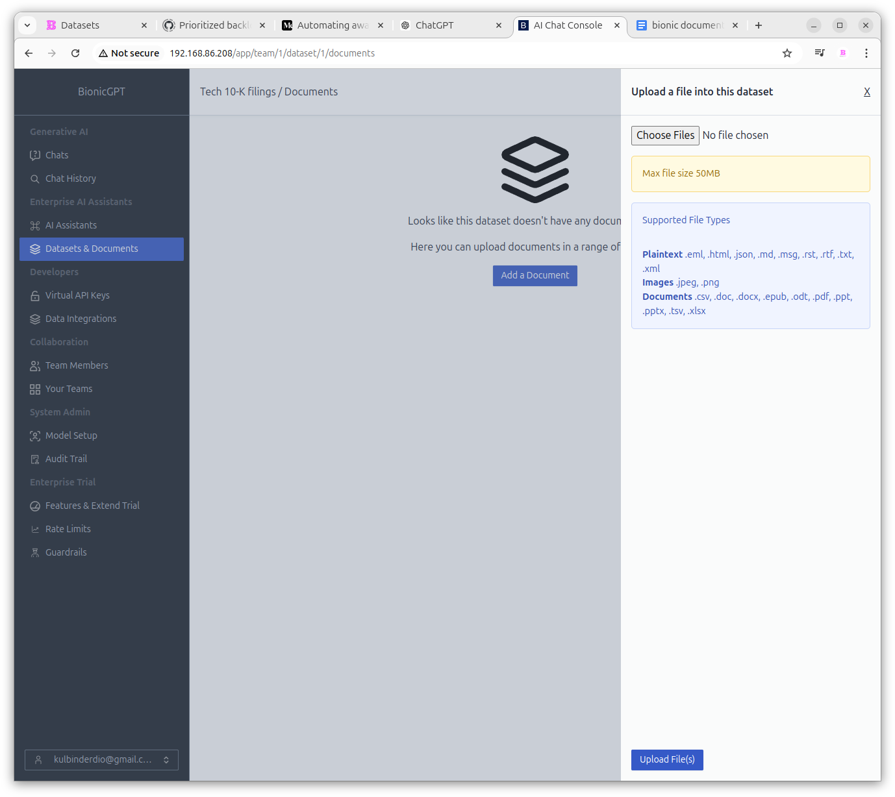

# Datasets & Documents

One of the key features of bionicGPT is its code-free RAG pipelines. To integrate your documents with large language models, you can upload document sets for future use. The text within these documents is divided into "chunks," encoded, and stored in a vector database for later retrieval via semantic search See AI Assistants for additional information.

### Adding a Dataset

#### Advanced Parameters

1. **Embedding Model** - This is the model that will convert the textual data into numeric based data for storage into the vector database. For details on setting up different Embedding Models see the Managing Models documentation. For additional information on Embedding Models see [Getting Started With Embeddings](https://huggingface.co/blog/getting-started-with-embeddings)

2. **Chunking Strategy** - chunking strategy refers to the method used to break down large documents or texts into smaller, manageable pieces or "chunks," which are then stored and retrieved individually to provide relevant information in response to user queries. The default value in bionicGPT is 'By Title'. The 'By Title' chunking strategy involves splitting a document into chunks based on its section or chapter titles, with each chunk containing the content that follows a specific title. This allows for easier retrieval of relevant sections based on their headings.

3. **Combine Under N Chars** - Text sections that are shorter than the number of characters defined here will be combined together

4. **New After N Chars** - This is the maximum size of any individual section. Sections larger than this size will be split into multiple sections.

5. **Multipage Sections** - If a section spans multiple pages this parameter determines whether to split at the page or not.

### Adding Documents to a Dataset

After creating your Dataset, selecting it will take you to a screen where you can upload documents. By using the "Choose File" button, you can select multiple documents at once. The selected documents will then enter a queue to be processed into embeddings and stored in the vector database. Once processing is complete, the following information will be displayed for each uploaded document.

