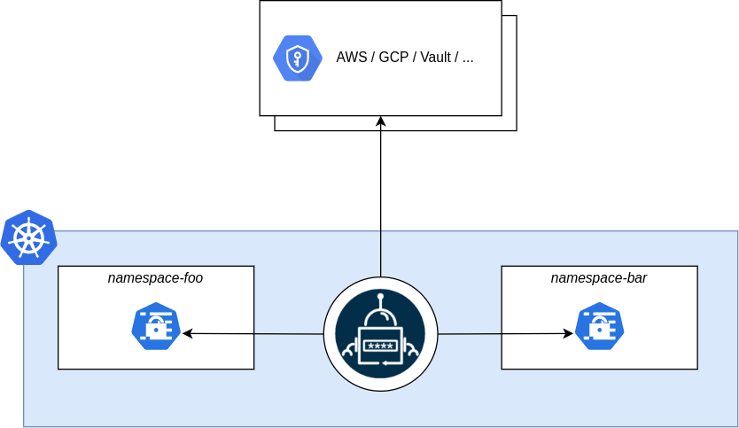

# Encryption at Rest

*Note: Encryption at Rest is currently in alpha testing*

**Important: Don't lose the encryption key. It's not possible to recover the data afterwards.**

To enable encryption at rest we need to create a kubernetes secret then add it as an env var to our Bionic installation.

```sh
kubectl -n bionic-gpt create secret generic customer-key \
  --from-literal=key="$(openssl rand -hex 32)"
```

## Add the Key to the Bionic Deployment

We need to add the key as an env var to the Bionic deployment.

```sh
kubectl -n bionic-gpt patch deployment bionic-gpt \
  --type='strategic' \
  -p '
spec:
  template:
    spec:
      containers:
      - name: bionic-gpt
        env:
        - name: CUSTOMER_KEY
          valueFrom:
            secretKeyRef:
              name: customer-key
              key: key'
```

## Add the Key to the RAG Engine Deployment

```sh
kubectl -n bionic-gpt patch deployment bionic-rag-engine \
  --type='strategic' \
  -p '
spec:
  template:
    spec:
      containers:
      - name: bionic-rag-engine
        env:
        - name: CUSTOMER_KEY
          valueFrom:
            secretKeyRef:
              name: customer-key
              key: key'
```

## External Secrets Operator



If you want to use external secrets managers such as an HSM or Hashicorp Vault then we recommend the [External Secrets Operator](https://external-secrets.io)