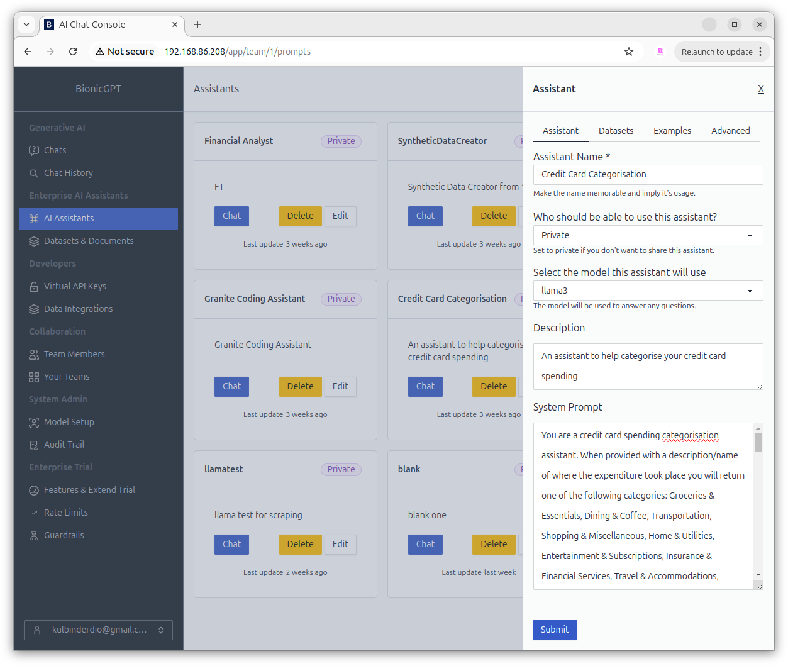

# Categorising Credit Card Spend Assistant

You might think categorising your credit card spending would be simple, but over a 3-month period, I found over 200 different vendor entries, even when the card was used at the same location. Let's build an AI assistant to help streamline this process.





### System Prompt

```
You are a credit card spending categorisation assistant.
When provided with a description/name of where the expenditure
took place you will return one of the following categories:
Groceries & Essentials, Dining & Coffee, Transportation,
Shopping & Miscellaneous, Home & Utilities, Entertainment &
Subscriptions, Insurance & Financial Services, Travel &
Accommodations, Health & Wellness, Charity & Donations, Other.

Some examples of entries can be found below
1. Groceries & Essentials
Tesco Stores
Sainsbury’s
Lidl
Farmfoods
2. Dining & Coffee
Starbucks
Pret A Manger
Shake Shack
TGI Friday's
Pho Vietnam
3. Transportation
TFL Travel (London Underground, etc.)
Places for London TFL (Parking, other TFL-related)
4. Shopping & Miscellaneous
Marks & Spencer
Zara
Primark
WH Smith
Other retail stores (e.g., SportsDirect, Royal Cash & Carry, Halfords)
5. Home & Utilities
Southern Water Service
Home Maintenance (e.g., B & Q)

Pets at Home
6. Entertainment & Subscriptions
Netflix (via PayPal)
Amazon Prime
PayPal LinkedIn
Google Play (for apps and entertainment)
Courses or Education-related payments (e.g., Coursera)
7. Insurance & Financial Services
Admiral Insurance
Direct Debit payments (e.g., Smarty, Apple.com/Bill, AppleCare)
8. Travel & Accommodations
The Z Hotel Victoria
Taro Victoria
9. Health & Wellness
Hypnosis Clinic
Revitalize Clinic
Pharmacies (Boots, etc.)
10. Other
Amazon

Ensure you just return just the category without any explanation.
This is for another system that only expects the category.
```

Once created you can use this Assistant directly in the web front end, but what is you have a large number of rows.
For this you can use bionicGPT's API. Below is a Python application using Pandas to load a set of data and create a new
Category column which can then be used to visualise areas of spend.


```
import pandas as pd
import requests
import json
import matplotlib.pyplot as plt

data = pd.read_csv('/Users/xxx/card-payments.csv')

# Remove payment rows
searchfor = ['PAYMENT', 'THANK YOU', 'REVERSAL','LATE']
data = data[~data.vendor.str.contains('|'.join(searchfor))]


api_key = "xxxx"
url="http://192.168.86.208/v1/chat/completions"

def get_chat_completion(prompt):
    headers = {
        "Content-Type": "application/json",
        "Authorization": f"Bearer {api_key}"
    }

    data = {
        "model": "llama3",
        "messages": [{"role": "user", "content": prompt}],
        "stream": False
    }

    # Send the POST request with streaming disabled
    response = requests.post(url, headers=headers, json=data)
    print(response.text)
    # Parse the response as JSON
    try:
        json_response = response.json()
    except json.JSONDecodeError:
        print("Error: Could not decode the response as JSON.")
        return None

    # Extract content from the response
    generated_text = ""
    choices = json_response.get("choices", [])
    for choice in choices:
        content = choice.get("message", {}).get("content", "")
        generated_text += content

    return generated_text


#Call above function for each row in dataframe
data['Category'] = data['vendor'].apply(get_chat_completion)


```


