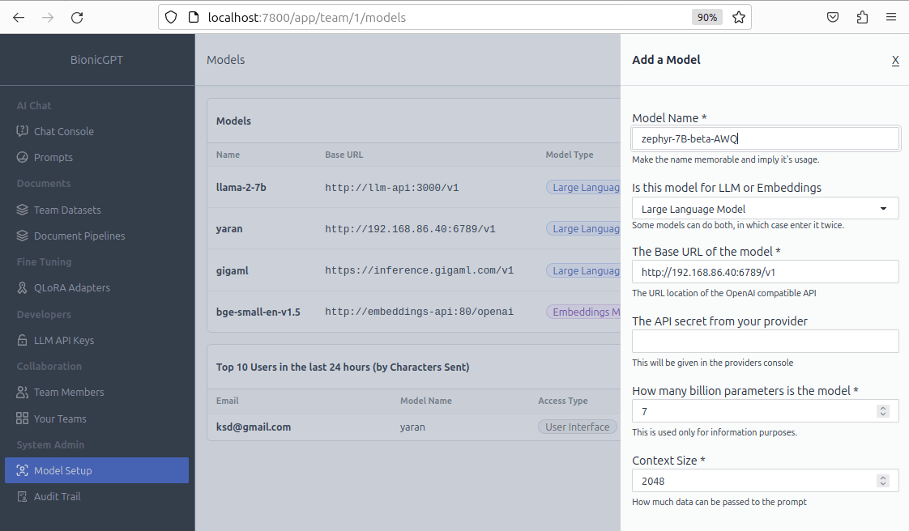

# Managing Models

**bionicGPT** is designed with flexibility and extensibility at its core, allowing you to configure as many models as you need. You can integrate both locally deployed models and externally hosted models, such as ChatGPT. This flexibility enables you to select and deploy the "best model for the job," whether that means different models for various teams or functions within your organization, or even multiple models for each team.

For externally hosted model, one that's not running in your Kubernetes cluster. You have 2 options.

1. The provider supports the Open AI (becoming an industry standard)`chat/completions` [API](https://platform.openai.com/docs/api-reference/chat).
1. They don't in which case we need to install Lite LLM.

## The provider supports the Open AI `chat/completions` API

Great news. Add the URL for your provider and any API keys directly into the models section of the user interface.

## For providers that don't support the Open AI `chat/completions` API (Work in Progress)

Luckily the guys at [Lite LLM](https://litellm.ai/) have got you covered. They basically connect to any provider and create an Open AI `chat/completions` API endpoint to your model.

## Model Setup

1. **Model Name** - This is the name of the model and must match exactly as specified in the inference engine

2. **LLM, Embeddings or Text-to-Speech** - bionicGPT allows for 3 different types of models, LLMs are used for normal 'chat' mode, Embedding models are used for the RAG functionality to convert uploaded text into Embeddings for RAG searching and text to speech models. Once a text-to-speech model has been added you will see an extra icon appear under each chat, clicking on this will 'speak' the returned text.

3. **Model URL** - this is the address of the deployed model, example http://api.groq.com/v1

4. **API Key** - The majority of externally hosted models work via the use of an API key, this is provided by the hosting service

5. **Model size** - the maximum amount of text that a language model can consider in a single interaction, including both the input you send (such as prompts or previous conversation history) and the response generated by the model. This limit determines how much context from the conversation can be retained and used to generate a relevant and coherent response.

6. **Context Size** - Specifies the maximum amount of data that can be passed to and from the LLM. This defined by the model provider
