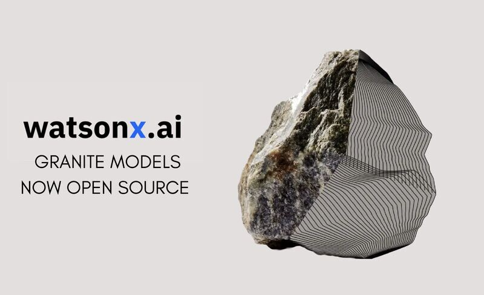

# IBM Granite Models

Open-sourced family of core Granite models is available under an Apache 2.0.
A number of specialist models are available covering coding, time-series, GIS, toxicity classifier and more. https://www.ibm.com/granite

### Granite Code

Decoder-only models designed for code generative tasks, trained with code written in 116 programming languages.

[granite-8b-code-instruct-4k](https://huggingface.co/ibm-granite/granite-8b-code-instruct-4k)

[granite-34b-code-instruct-8k](https://huggingface.co/ibm-granite/granite-34b-code-instruct-8k)

### Granite Guardian
4-layer toxicity binary classifier for English. It has been trained on several benchmark datasets in English, specifically for detecting hateful, abusive, profane and other toxic content in plain text.

[granite-8b-code-instruct-4k](https://huggingface.co/ibm-granite/granite-8b-code-instruct-4k)

[granite-guardian-hap-125m](https://huggingface.co/ibm-granite/granite-guardian-hap-125m)

