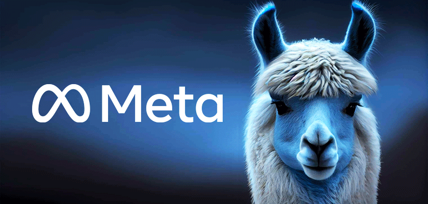

# Meta's Llama Models

Llama is a family of autoregressive large language models (LLMs) released by Meta AI starting in February 2023. Llama models are trained at different parameter sizes, ranging between 1B and 405B. Originally, Llama was only available as a foundation model. Starting with Llama 2, Meta AI started releasing instruction fine-tuned versions alongside foundation models.

### Llama 3
On April 18, 2024, Meta released Llama-3 with two sizes: 8B and 70B parameters.[18] The models have been pre-trained on approximately 15 trillion tokens of text gathered from “publicly available sources” with the instruct models fine-tuned on “publicly available instruction datasets, as well as over 10M human-annotated examples".

### Llama 3.1
The Meta Llama 3.1 collection of multilingual large language models (LLMs) is a collection of pretrained and instruction tuned generative models in 8B, 70B and 405B sizes (text in/text out). The Llama 3.1 instruction tuned text only models (8B, 70B, 405B) are optimized for multilingual dialogue use cases and outperform many of the available open source and closed chat models on common industry benchmarks.

[Llama-3.1-8B-Instruct](https://https://huggingface.co/meta-llama/Llama-3.1-8B-Instruct)

[Llama-3.1-70B-Instruct](https://https://huggingface.co/meta-llama/Llama-3.1-70B-Instruct)

### Llama3.2
Llama 3.2, includes small and medium-sized vision LLMs (11B and 90B), and lightweight, text-only models (1B and 3B) that fit onto edge and mobile devices, including pre-trained and instruction-tuned versions.

[Llama-3.2-1B-Instruct](https://huggingface.co/meta-llama/Llama-3.2-1B-Instruct)

[Llama-3.2-3B-Instruct](https://huggingface.co/meta-llama/Llama-3.2-3B-Instruct)

### Code Llama
Code Llama is a fine-tune of Llama 2 with code specific datasets. 7B, 13B, and 34B versions were released on August 24, 2023, with the 70B releasing on the January 29, 2024. Starting with the foundation models from Llama 2, Meta AI would train an additional 500B tokens of code datasets, before an additional 20B token of long-context data, creating the Code Llama foundation models. This foundation model was further trained on 5B instruction following token to create the instruct fine-tune. Another foundation model was created for Python code, which trained on 100B tokens of Python-only code.

[CodeLlama-7b-Instruct-hf](https://huggingface.co/meta-llama/CodeLlama-7b-Instruct-hf)

[CodeLlama-13b-Instruct-hf](https://huggingface.co/meta-llama/CodeLlama-13b-Instruct-hf)

[CodeLlama-34b-Instruct-hf](https://huggingface.co/meta-llama/CodeLlama-34b-Instruct-hf)

[CodeLlama-70b-Instruct-hf](https://huggingface.co/meta-llama/CodeLlama-70b-Instruct-hf)

[CodeLlama-7b-Python-hf](https://huggingface.co/meta-llama/CodeLlama-7b-Python-hf)

[CodeLlama-13b-Python-hf](https://huggingface.co/meta-llama/CodeLlama-13b-Python-hf)

[CodeLlama-34b-Python-hf](https://huggingface.co/meta-llama/CodeLlama-34b-Python-hf)

[CodeLlama-70b-Python-hf](https://huggingface.co/meta-llama/CodeLlama-70b-Python-hf)

