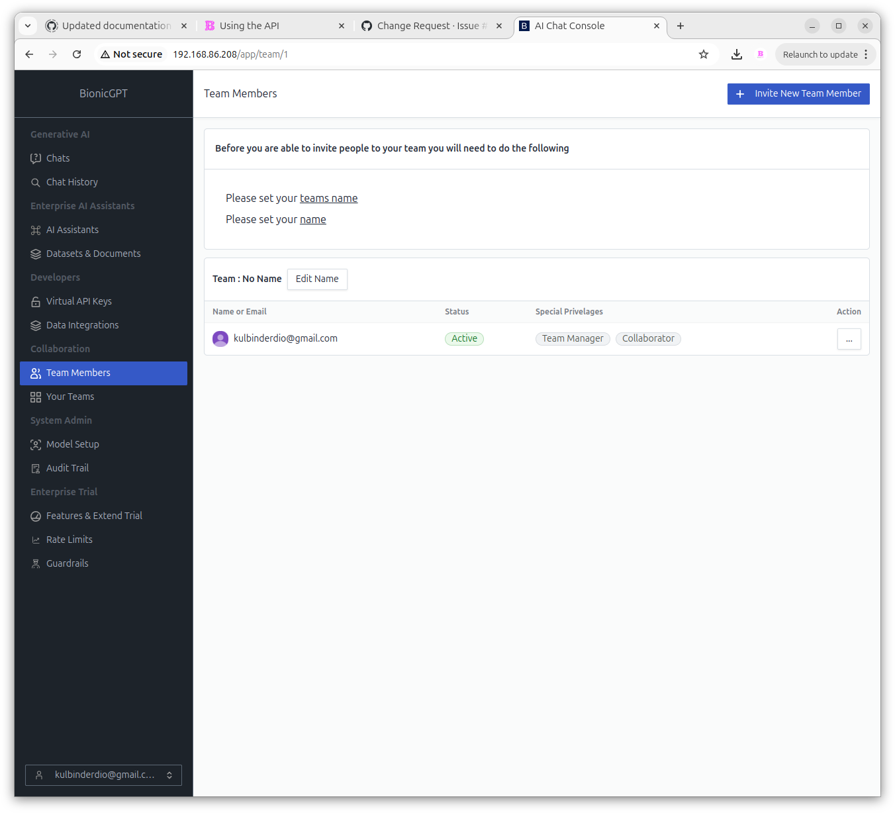
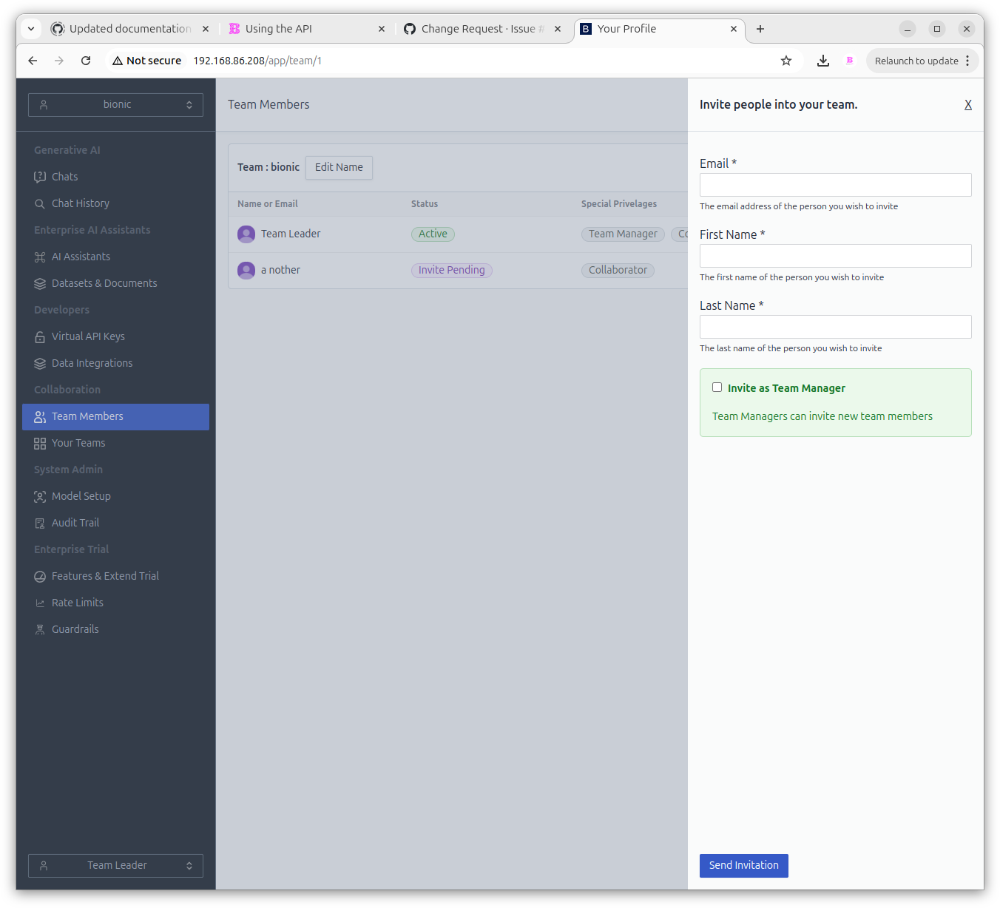
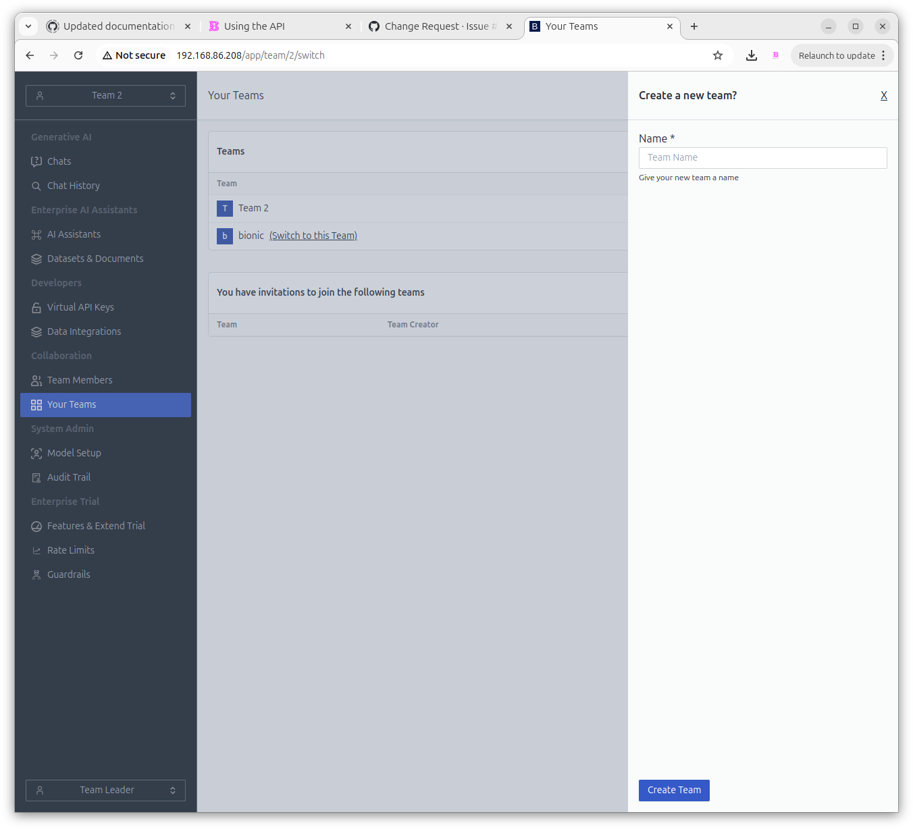

# Teams

**bionicGPT** provides a teams based permissioning model allowing you to decide who has access to what datasets and AI Assistants

### Invite Team Members

To add members to your team requires the user to accept an invitation sent by email

### Your Teams

This screen shows all Teams the current user is a member or leader of.
This screen also allows you to create new Teams.

