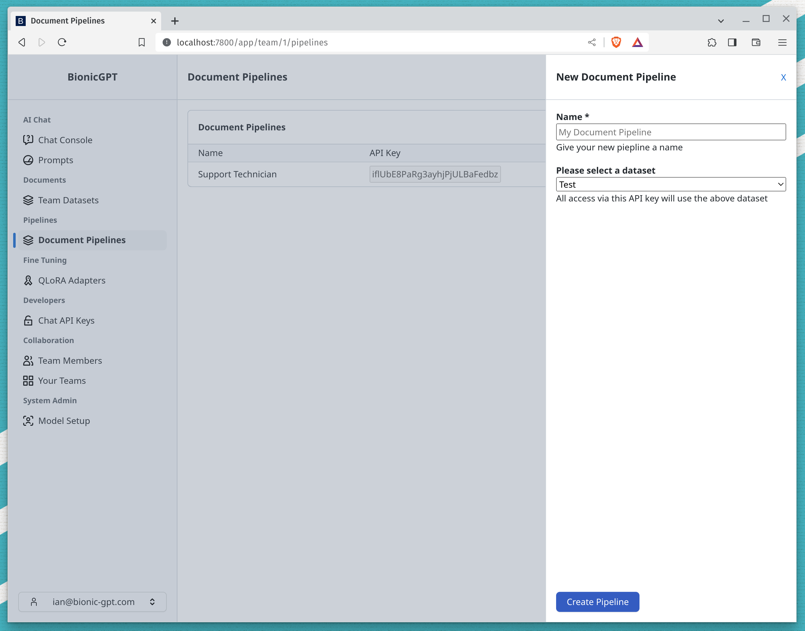
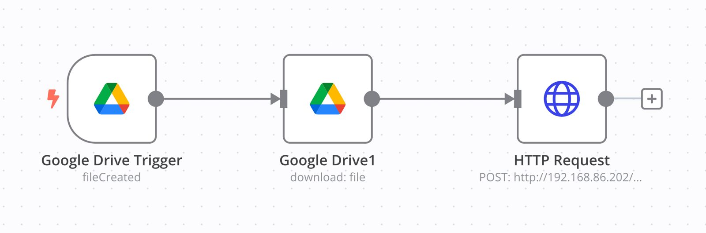

# Document Pipelines

Document pipelines give you a way to upload documents via an API. You first need to create an API key and attach that to a dataset. The documents will be uploaded to that dataset.



## Accessing the API

The following `curl` example shows you how to upload a file.

```sh
curl -X 'POST' \
'http://localhost:7800/v1/document_upload' \
-H "Authorization: Bearer $UPLOAD_API_KEY" \
-H 'accept: application/json' \
-H 'Content-Type: multipart/form-data' \
-F 'files=@YOURDOCUMENT.pdf'
```

Change `YOURDOCUMENT.pdf` to match the name and location of the document you want to upload and `$UPLOAD_API_KEY` to match the API key that was generated in the user interface.

Your document will appear on the datasets screen where you can see it's progress through the pipeline.


### Tools

This interface supports direct coding, but many tools are available to help you set up automated pipelines without
writing any code. For example, the image below shows an **n8n** workflow that periodically monitors a specific folder on
Google Drive for new files. When new files are detected, they are automatically uploaded to a designated dataset via an
API call.





