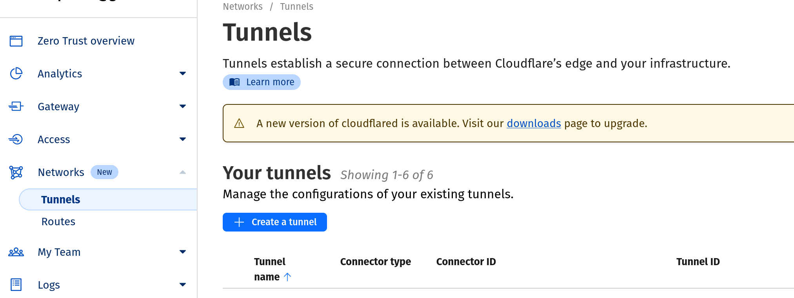
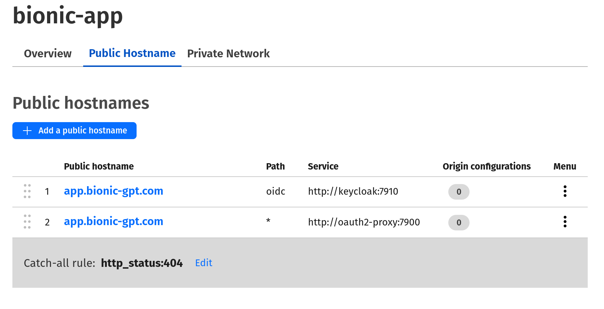

# Setup a Cloudflare Tunnel

From the Cloudflare dashboard go to `zero trust / networks`. Then create a tunnel and give it a name.



- Tunnel Type - Cloudfared
- Name - bionic-gpt

## Get your Cloudflare tunnel secret

This is a bit tricky as you'll need to copy paste the command line Cloudflare gives you and just extract the secret.

We just need the secret itself.

```sh
eyJhIjoiOGMyN2IyMTg1M2YwY2VhOWQ1YTFmNmUwMzAzMzUzNTIiLCJ0....................
```

## Install Cloudflare

```sh
export TUNNEL_TOKEN=eyJhIjoiOGMyN2IyMTg1M2YwY2VhOWQ1YTFmNmUwMzAzMzUzNTIiLCJ0....................
bionic cloudflare --token $TUNNEL_TOKEN --name bionic-gpt
```

## Connect to a domain

To connect to a domain you own you need to setup 2 routes as follows.


You should now be able to access bionic via your domain.