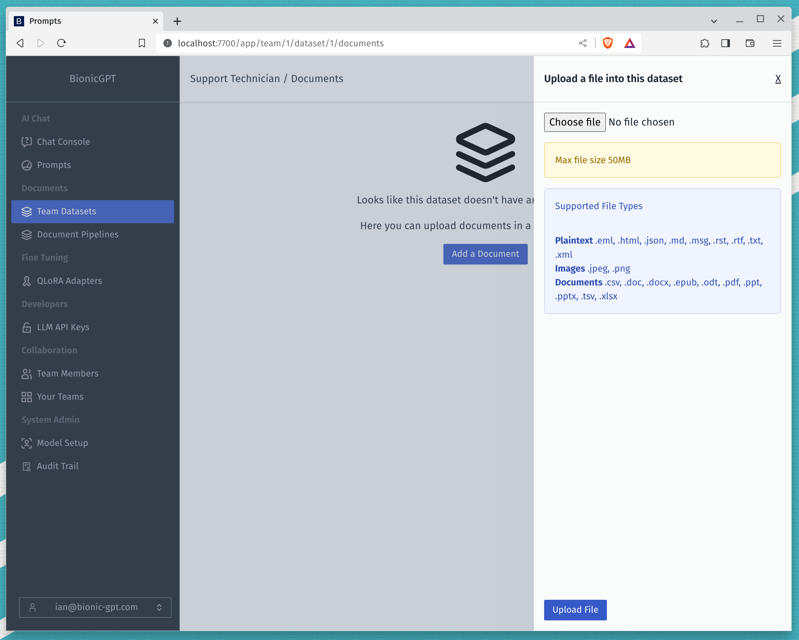

# AI Assistants or Retrieval Augmented Generation

<iframe width="560" height="315" src="https://www.youtube.com/embed/mNFd0Bur238?si=JlP70y5QclqdD9mi" title="YouTube video player" frameborder="0" allow="accelerometer; autoplay; clipboard-write; encrypted-media; gyroscope; picture-in-picture; web-share" allowfullscreen></iframe>

We're assuming that you've identified one or more use cases and along the lines of chatting with company private documents.

## Document Upload

Having identified documents that you would the LLM to use as part of it's answers, you can upload those documents via the user interface.

In the background we use a service called unstructured to remove the text from those documents. So the quality of answers you get is going to depend on the quality of the text within those documents.

## Selecting Datasets

Once you've uploaded your documents go to the chat window and in the prompt dropdown choose 'Default (Use All Datasets)' you can then try out your questions.

## Collecting Questions

It's probably a good idea to track your questions with an without the datasets to give you some idea of how BionicGPT is working with your data.