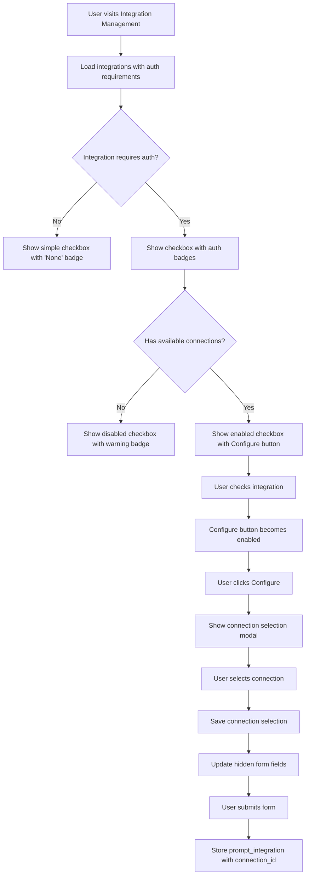

# Integration Connection Enhancement Plan

## Overview

This document outlines the plan to enhance the integration management system to support API key and OAuth2 connections when attaching integrations to prompts. The current system only allows simple checkbox selection of integrations, but we need to support selecting specific authentication connections for integrations that require them.

## Current State Analysis

### Current Flow
1. User selects integrations via checkboxes in [`crates/web-pages/my_assistants/integrations.rs`](crates/web-pages/my_assistants/integrations.rs)
2. System stores simple `prompt_integration` records with only `prompt_id` and `integration_id`
3. No connection information is captured

### Database Schema
The migration [`crates/db/migrations/20250610000000_prompt_integration_connections.sql`](crates/db/migrations/20250610000000_prompt_integration_connections.sql) adds:
- `api_connection_id` (nullable, references `api_key_connections`)
- `oauth2_connection_id` (nullable, references `oauth2_connections`)
- Constraint ensuring only one connection type per integration

### Authentication Detection
Using [`crates/integrations/bionic_openapi.rs`](crates/integrations/bionic_openapi.rs):
- [`has_api_key_security()`](crates/integrations/bionic_openapi.rs:309) - detects API key requirements
- [`has_oauth2_security()`](crates/integrations/bionic_openapi.rs:323) - detects OAuth2 requirements

## Implementation Plan

### Phase 1: Database Layer Updates

#### 1.1 Create New SQL File and Move Queries

**File: `crates/db/queries/prompt_integrations.sql`** (New file)

Move existing prompt_integration queries from `prompts.sql` and add new ones:

```sql
--: PromptIntegration()
--: PromptIntegrationWithConnection()

--! prompt_integrations : PromptIntegration
SELECT
    i.id as integration_id,
    pi.prompt_id as prompt_id,
    i.name,
    i.integration_type,
    i.integration_status
FROM
    integrations i
LEFT JOIN
    prompt_integration pi
ON
    i.id = pi.integration_id
WHERE
    pi.prompt_id = :prompts_id;

--! delete_prompt_integrations
DELETE FROM prompt_integration
WHERE
    prompt_id = :prompts_id
AND
    prompt_id IN (
        SELECT id FROM prompts WHERE model_id IN(
            SELECT id FROM models WHERE team_id IN(
                SELECT team_id
                FROM team_users
                WHERE user_id = current_app_user()
            )
        )
    );

--! insert_prompt_integration
INSERT INTO prompt_integration(
    prompt_id,
    integration_id
)
VALUES(
    :prompt_id, :integration_id);

--! insert_prompt_integration_with_connection
INSERT INTO prompt_integration(
    prompt_id,
    integration_id,
    api_connection_id,
    oauth2_connection_id
)
VALUES(
    :prompt_id,
    :integration_id,
    :api_connection_id,
    :oauth2_connection_id
);

--! get_prompt_integrations_with_connections : PromptIntegrationWithConnection
SELECT
    pi.prompt_id,
    pi.integration_id,
    pi.api_connection_id,
    pi.oauth2_connection_id,
    i.name as integration_name,
    i.definition as integration_definition,
    akc.id as api_key_connection_name,
    o2c.id as oauth2_connection_name
FROM prompt_integration pi
JOIN integrations i ON pi.integration_id = i.id
LEFT JOIN api_key_connections akc ON pi.api_connection_id = akc.id
LEFT JOIN oauth2_connections o2c ON pi.oauth2_connection_id = o2c.id
WHERE pi.prompt_id = :prompt_id;
```

**Migration of Existing Queries:**
- Move `prompt_integrations` query from `prompts.sql` line 479-493
- Move `delete_prompt_integrations` query from `prompts.sql` line 495-508
- Move `insert_prompt_integration` query from `prompts.sql` line 510-516

#### 1.2 Add Connection Queries

**File: `crates/db/queries/connections.sql`**

Add queries to get available connections for a team and integration:

```sql
--! get_team_api_key_connections : ApiKeyConnection
SELECT id, integration_id, user_id, team_id, visibility, created_at
FROM api_key_connections
WHERE team_id = :team_id AND integration_id = :integration_id;

--! get_team_oauth2_connections : Oauth2Connection  
SELECT id, integration_id, user_id, team_id, visibility, expires_at, scopes, created_at
FROM oauth2_connections
WHERE team_id = :team_id AND integration_id = :integration_id;
```

### Phase 2: Backend Handler Updates

#### 2.1 Enhanced Data Structures

**File: `crates/web-pages/my_assistants/integrations.rs`**

Update the form structure to support connection selection:

```rust
#[derive(Deserialize, Validate, Default, Debug)]
pub struct IntegrationForm {
    pub prompt_id: i32,
    pub prompt_name: String,
    pub selected_integration_ids: Vec<i32>,
    pub integration_connections: HashMap<i32, ConnectionSelection>, // New field
    #[serde(skip)]
    pub error: Option<String>,
    #[serde(skip)]
    pub integrations: Vec<IntegrationWithAuthInfo>, // Enhanced integration info
    #[serde(skip)]
    pub available_connections: HashMap<i32, AvailableConnections>, // New field
}

#[derive(Deserialize, Debug, Clone)]
pub struct ConnectionSelection {
    pub api_connection_id: Option<i32>,
    pub oauth2_connection_id: Option<i32>,
}

#[derive(Debug, Clone)]
pub struct IntegrationWithAuthInfo {
    pub integration: Integration,
    pub requires_api_key: bool,
    pub requires_oauth2: bool,
    pub has_connections: bool,
}

#[derive(Debug, Clone)]
pub struct AvailableConnections {
    pub api_key_connections: Vec<ApiKeyConnection>,
    pub oauth2_connections: Vec<Oauth2Connection>,
}
```

#### 2.2 Update Handler Logic

**File: `crates/web-server/handlers/my_assistants/integrations.rs`**

Enhance the `manage_integrations` function:

```rust
pub async fn manage_integrations(
    ManageIntegrations { team_id, prompt_id }: ManageIntegrations,
    current_user: Jwt,
    Extension(pool): Extension<Pool>,
) -> Result<Html<String>, CustomError> {
    let mut client = pool.get().await?;
    let transaction = client.transaction().await?;

    let rbac = authz::get_permissions(&transaction, &current_user.into(), team_id).await?;

    let integrations = queries::integrations::integrations()
        .bind(&transaction)
        .all()
        .await?;

    // Analyze each integration for auth requirements
    let mut integrations_with_auth: Vec<IntegrationWithAuthInfo> = Vec::new();
    let mut available_connections: HashMap<i32, AvailableConnections> = HashMap::new();

    for integration in integrations {
        let (requires_api_key, requires_oauth2) = analyze_integration_auth(&integration)?;
        
        if requires_api_key || requires_oauth2 {
            let api_connections = if requires_api_key {
                queries::connections::get_team_api_key_connections()
                    .bind(&transaction, &team_id, &integration.id)
                    .all()
                    .await?
            } else {
                Vec::new()
            };

            let oauth2_connections = if requires_oauth2 {
                queries::connections::get_team_oauth2_connections()
                    .bind(&transaction, &team_id, &integration.id)
                    .all()
                    .await?
            } else {
                Vec::new()
            };

            let has_connections = !api_connections.is_empty() || !oauth2_connections.is_empty();

            available_connections.insert(integration.id, AvailableConnections {
                api_key_connections: api_connections,
                oauth2_connections: oauth2_connections,
            });

            integrations_with_auth.push(IntegrationWithAuthInfo {
                integration,
                requires_api_key,
                requires_oauth2,
                has_connections,
            });
        } else {
            integrations_with_auth.push(IntegrationWithAuthInfo {
                integration,
                requires_api_key: false,
                requires_oauth2: false,
                has_connections: true, // No auth required, so always "available"
            });
        }
    }

    // Get existing prompt integrations with connections
    let existing_connections = queries::prompt_integrations::get_prompt_integrations_with_connections()
        .bind(&transaction, &prompt_id)
        .all()
        .await?;

    let mut integration_connections: HashMap<i32, ConnectionSelection> = HashMap::new();
    let mut selected_integration_ids: Vec<i32> = Vec::new();

    for existing in existing_connections {
        selected_integration_ids.push(existing.integration_id);
        integration_connections.insert(existing.integration_id, ConnectionSelection {
            api_connection_id: existing.api_connection_id,
            oauth2_connection_id: existing.oauth2_connection_id,
        });
    }

    let prompt = queries::prompts::prompt()
        .bind(&transaction, &prompt_id, &team_id)
        .one()
        .await?;

    let form = my_assistants::integrations::IntegrationForm {
        prompt_id: prompt.id,
        prompt_name: prompt.name,
        integrations: integrations_with_auth,
        selected_integration_ids,
        integration_connections,
        available_connections,
        error: None,
    };

    let html = my_assistants::integrations::page(team_id, rbac, form);
    Ok(Html(html))
}

fn analyze_integration_auth(integration: &Integration) -> Result<(bool, bool), CustomError> {
    if let Some(definition) = &integration.definition {
        let bionic_api = integrations::bionic_openapi::BionicOpenAPI::new(definition)
            .map_err(|e| CustomError::BadRequest(format!("Invalid OpenAPI spec: {}", e)))?;
        
        let requires_api_key = bionic_api.has_api_key_security();
        let requires_oauth2 = bionic_api.has_oauth2_security();
        
        Ok((requires_api_key, requires_oauth2))
    } else {
        Ok((false, false))
    }
}
```

#### 2.3 Update Form Processing

```rust
#[derive(Deserialize, Validate, Default, Debug)]
pub struct IntegrationUpdateForm {
    #[serde(default)]
    pub integrations: Vec<i32>,
    #[serde(default)]
    pub integration_connections: HashMap<String, ConnectionSelection>, // String keys from form
}

pub async fn update_integrations_action(
    UpdateIntegrations { team_id, prompt_id }: UpdateIntegrations,
    current_user: Jwt,
    Extension(pool): Extension<Pool>,
    Form(form): Form<IntegrationUpdateForm>,
) -> Result<impl IntoResponse, CustomError> {
    let mut client = pool.get().await?;
    let transaction = client.transaction().await?;

    let _rbac = authz::get_permissions(&transaction, &current_user.into(), team_id).await?;

    // Delete existing integration connections
    queries::prompt_integrations::delete_prompt_integrations()
        .bind(&transaction, &prompt_id)
        .await?;

    // Add new integration connections with connection info
    for integration_id in form.integrations {
        let connection_key = integration_id.to_string();
        let connection = form.integration_connections.get(&connection_key);

        queries::prompt_integrations::insert_prompt_integration_with_connection()
            .bind(
                &transaction,
                &prompt_id,
                &integration_id,
                &connection.and_then(|c| c.api_connection_id),
                &connection.and_then(|c| c.oauth2_connection_id),
            )
            .await?;
    }

    transaction.commit().await?;

    Ok(crate::layout::redirect_and_snackbar(
        &web_pages::routes::prompts::View { team_id, prompt_id }.to_string(),
        "Integration connections updated successfully",
    )
    .into_response())
}
```

### Phase 3: Frontend UI Updates

#### 3.1 Enhanced Integration Table

**File: `crates/web-pages/my_assistants/integrations.rs`**

Update the integration table to show auth requirements and connection status using Daisy UI components:

```rust
table {
    class: "table table-sm w-full",
    thead {
        tr {
            th { "Integration" }
            th { "Type" }
            th { "Status" }
            th { "Authentication" }
            th { "Add?" }
        }
    }
    tbody {
        for integration_info in &form.integrations {
            let integration = &integration_info.integration;
            tr {
                td { "{integration.name}" }
                td { "{integration.integration_type:?}" }
                td {
                    Badge {
                        badge_type: match integration.integration_status {
                            db::IntegrationStatus::Configured => BadgeType::Success,
                            _ => BadgeType::Warning
                        },
                        "{integration.integration_status:?}"
                    }
                }
                td {
                    // Auth requirements indicator
                    if integration_info.requires_api_key || integration_info.requires_oauth2 {
                        div {
                            class: "flex items-center gap-1",
                            if integration_info.requires_api_key {
                                Badge {
                                    badge_type: BadgeType::Outline,
                                    size: BadgeSize::Small,
                                    "API Key"
                                }
                            }
                            if integration_info.requires_oauth2 {
                                Badge {
                                    badge_type: BadgeType::Outline,
                                    size: BadgeSize::Small,
                                    "OAuth2"
                                }
                            }
                            if !integration_info.has_connections {
                                Badge {
                                    badge_type: BadgeType::Error,
                                    size: BadgeSize::Small,
                                    title: "No connections available",
                                    "⚠️"
                                }
                            }
                        }
                    } else {
                        Badge {
                            badge_type: BadgeType::Ghost,
                            size: BadgeSize::Small,
                            "None"
                        }
                    }
                }
                td {
                    div {
                        class: "flex items-center gap-2",
                        if form.selected_integration_ids.contains(&integration.id) {
                            CheckBox {
                                checked: true,
                                name: "integrations",
                                value: "{integration.id}"
                            }
                        } else {
                            CheckBox {
                                name: "integrations",
                                value: "{integration.id}",
                                disabled: (integration_info.requires_api_key || integration_info.requires_oauth2) && !integration_info.has_connections
                            }
                        }
                        
                        // Connection configuration button
                        if (integration_info.requires_api_key || integration_info.requires_oauth2) && integration_info.has_connections {
                            let trigger_id = format!("connection-modal-{}", integration.id);
                            Button {
                                button_type: ButtonType::Button,
                                button_scheme: ButtonScheme::Outline,
                                size: ButtonSize::Small,
                                trigger_id: trigger_id.clone(),
                                disabled: !form.selected_integration_ids.contains(&integration.id),
                                "Configure"
                            }
                        }
                    }
                }
            }
        }
    }
}
```

#### 3.2 Connection Selection Modal Component

Create a new modal component for connection selection, similar to [`crates/web-pages/confirm_modal.rs`](crates/web-pages/confirm_modal.rs):

**File: `crates/web-pages/my_assistants/connection_modal.rs`** (New file)

```rust
#![allow(non_snake_case)]
use daisy_rsx::*;
use dioxus::prelude::*;
use crate::my_assistants::integrations::{AvailableConnections, ConnectionSelection};

#[derive(Props, Clone, PartialEq)]
pub struct ConnectionModalProps {
    integration_id: i32,
    integration_name: String,
    available_connections: AvailableConnections,
    current_selection: Option<ConnectionSelection>,
    trigger_id: String,
}

#[component]
pub fn ConnectionModal(props: ConnectionModalProps) -> Element {
    rsx! {
        Modal {
            trigger_id: props.trigger_id,
            ModalBody {
                h3 {
                    class: "font-bold text-lg mb-4",
                    "Configure Connection for {props.integration_name}"
                }
                
                div {
                    class: "space-y-4",
                    
                    // API Key Connection Selection
                    if !props.available_connections.api_key_connections.is_empty() {
                        div {
                            class: "form-control",
                            label {
                                class: "label",
                                span { class: "label-text", "API Key Connection" }
                            }
                            select {
                                name: "integration_connections[{props.integration_id}][api_connection_id]",
                                class: "select select-bordered w-full",
                                option { value: "", "Select API Key Connection" }
                                for connection in &props.available_connections.api_key_connections {
                                    option {
                                        value: "{connection.id}",
                                        selected: props.current_selection.as_ref()
                                            .and_then(|s| s.api_connection_id)
                                            .map(|id| id == connection.id)
                                            .unwrap_or(false),
                                        "API Key Connection {connection.id}"
                                    }
                                }
                            }
                        }
                    }
                    
                    // OAuth2 Connection Selection
                    if !props.available_connections.oauth2_connections.is_empty() {
                        div {
                            class: "form-control",
                            label {
                                class: "label",
                                span { class: "label-text", "OAuth2 Connection" }
                            }
                            select {
                                name: "integration_connections[{props.integration_id}][oauth2_connection_id]",
                                class: "select select-bordered w-full",
                                option { value: "", "Select OAuth2 Connection" }
                                for connection in &props.available_connections.oauth2_connections {
                                    option {
                                        value: "{connection.id}",
                                        selected: props.current_selection.as_ref()
                                            .and_then(|s| s.oauth2_connection_id)
                                            .map(|id| id == connection.id)
                                            .unwrap_or(false),
                                        "OAuth2 Connection {connection.id}"
                                    }
                                }
                            }
                        }
                    }
                }
                
                ModalAction {
                    Button {
                        button_type: ButtonType::Submit,
                        button_scheme: ButtonScheme::Primary,
                        "Save Connection"
                    }
                }
            }
        }
    }
}
```

#### 3.3 Update Integration Table with Modal Triggers

Update the integration table to use modal triggers instead of JavaScript:

```rust
// Connection configuration button
if (integration_info.requires_api_key || integration_info.requires_oauth2) && integration_info.has_connections {
    let trigger_id = format!("connection-modal-{}", integration.id);
    Button {
        button_type: ButtonType::Button,
        button_scheme: ButtonScheme::Outline,
        size: ButtonSize::Small,
        trigger_id: trigger_id.clone(),
        disabled: !form.selected_integration_ids.contains(&integration.id),
        "Configure"
    }
    
    // Add the modal for this integration
    if let Some(connections) = form.available_connections.get(&integration.id) {
        ConnectionModal {
            integration_id: integration.id,
            integration_name: integration.name.clone(),
            available_connections: connections.clone(),
            current_selection: form.integration_connections.get(&integration.id).cloned(),
            trigger_id: trigger_id,
        }
    }
}
```

// Add connection modals after the table
for integration_info in &form.integrations {
    let integration = &integration_info.integration;
    if (integration_info.requires_api_key || integration_info.requires_oauth2) && integration_info.has_connections {
        if let Some(connections) = form.available_connections.get(&integration.id) {
            let trigger_id = format!("connection-modal-{}", integration.id);
            ConnectionModal {
                integration_id: integration.id,
                integration_name: integration.name.clone(),
                available_connections: connections.clone(),
                current_selection: form.integration_connections.get(&integration.id).cloned(),
                trigger_id: trigger_id,
            }
        }
    }
}
```

### Phase 4: User Experience Flow



### Phase 5: Testing Strategy

#### 5.1 Unit Tests
- Test `analyze_integration_auth` function with various OpenAPI specs
- Test connection selection logic
- Test form validation and serialization

#### 5.2 Integration Tests
- Test full flow from integration selection to connection assignment
- Test error handling for missing connections
- Test UI interactions with Selenium

#### 5.3 Test Cases
1. **No Authentication Required**: Integration without security schemes
2. **API Key Required**: Integration with API key security, with and without available connections
3. **OAuth2 Required**: Integration with OAuth2 security, with and without available connections
4. **Mixed Requirements**: Multiple integrations with different auth requirements
5. **Connection Selection**: Proper storage and retrieval of connection selections

### Phase 6: Migration Strategy

#### 6.1 Database Migration
The migration is already in place: [`crates/db/migrations/20250610000000_prompt_integration_connections.sql`](crates/db/migrations/20250610000000_prompt_integration_connections.sql)

#### 6.2 Backward Compatibility
- Existing `prompt_integration` records without connections will continue to work
- New UI will show "None" badge for integrations without auth requirements
- Legacy integrations without OpenAPI specs will be treated as requiring no authentication

### Phase 7: Error Handling

#### 7.1 Frontend Validation
- Disable integration selection if no connections are available
- Show clear warning badges for missing connections
- Validate connection selection before form submission

#### 7.2 Backend Validation
- Validate that selected connections belong to the correct integration
- Ensure connection belongs to the user's team
- Handle cases where connections are deleted between selection and submission

#### 7.3 User Feedback
- Clear error messages for missing connections
- Success notifications for successful updates
- Loading states during connection validation

### Summary

This plan provides a comprehensive solution for:

1. **Authentication Detection**: Using [`BionicOpenAPI.has_api_key_security()`](crates/integrations/bionic_openapi.rs:309) and [`BionicOpenAPI.has_oauth2_security()`](crates/integrations/bionic_openapi.rs:323) to determine auth requirements

2. **Connection Management**: Enhanced UI with Daisy UI components and modal popups for selecting specific API key or OAuth2 connections

3. **Database Integration**: Updated queries to handle the new connection fields in [`prompt_integration`](crates/db/migrations/20250610000000_prompt_integration_connections.sql:4) table

4. **User Experience**: Clear indicators using Daisy UI badges for auth requirements and connection availability

5. **Robust Error Handling**: Comprehensive validation and user feedback

The implementation maintains backward compatibility while providing a rich, user-friendly interface for managing integration connections using consistent Daisy UI components throughout.