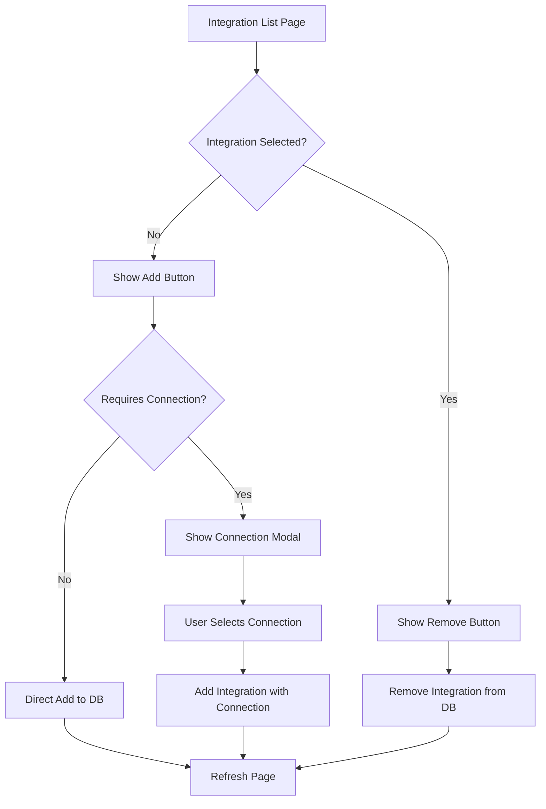
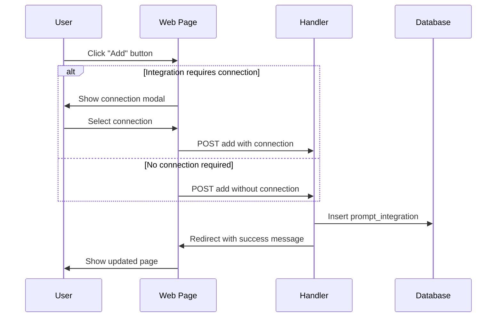
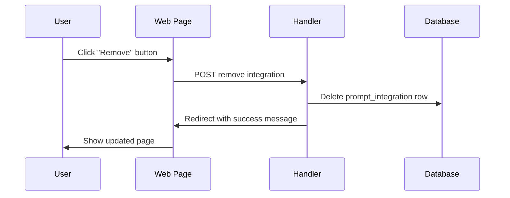

# Integration Management Refactor Plan

## Overview
Transform the integration management system from a checkbox-based bulk selection to an individual add/remove button system with immediate connection selection popups.

## Current System Analysis

The current system works as follows:
1. **UI**: Uses checkboxes to select multiple integrations at once
2. **Form Submission**: Bulk updates all integrations via a single form POST
3. **Backend**: Deletes all existing prompt_integrations and re-inserts selected ones
4. **Connection Selection**: Uses a separate "Configure" button that's only enabled when integration is checked

## Proposed New System

Transform to an individual add/remove button system with immediate connection selection:



## Implementation Plan

### Phase 1: Backend Changes

**1.1 Add New Routes**
- Add individual add/remove routes to `crates/web-pages/routes.rs`
```rust
// New routes to add:
AddIntegration { team_id: i32, prompt_id: i32, integration_id: i32 }
RemoveIntegration { team_id: i32, prompt_id: i32, integration_id: i32 }
```

**1.2 Create New Handler Functions**
- Add to `crates/web-server/handlers/my_assistants/integrations.rs`
```rust
// New handler functions:
pub async fn add_integration_action() -> Result<impl IntoResponse, CustomError>
pub async fn remove_integration_action() -> Result<impl IntoResponse, CustomError>
```

**1.3 Database Query Updates**
- Add new query for deleting specific integration
- Use existing `insert_prompt_integration_with_connection` for adds

### Phase 2: Frontend Changes

**2.1 Update Integration Form Structure**
- Remove the bulk form submission from `crates/web-pages/my_assistants/integrations.rs`
- Replace with individual action buttons per integration row

**2.2 Replace Checkbox Column with Action Buttons**
- Current: Checkbox + Configure button
- New: Add/Remove button with integrated connection selection

**2.3 Add Connection Selection Modal**
- Create popup modal for connection selection when adding integrations that require authentication
- Include both API key and OAuth2 connection dropdowns as needed

### Phase 3: User Experience Flow

**3.1 Add Integration Flow**


**3.2 Remove Integration Flow**


## Implementation Steps

### Step 1: Add New Routes
```rust
// In crates/web-pages/routes.rs, add to prompts module:
#[derive(TypedPath, Deserialize)]
#[typed_path("/app/team/{team_id}/assistant/{prompt_id}/integrations/add/{integration_id}")]
pub struct AddIntegration {
    pub team_id: i32,
    pub prompt_id: i32,
    pub integration_id: i32,
}

#[derive(TypedPath, Deserialize)]
#[typed_path("/app/team/{team_id}/assistant/{prompt_id}/integrations/remove/{integration_id}")]
pub struct RemoveIntegration {
    pub team_id: i32,
    pub prompt_id: i32,
    pub integration_id: i32,
}
```

### Step 2: Create Handler Functions
```rust
// In crates/web-server/handlers/my_assistants/integrations.rs:

#[derive(Deserialize)]
pub struct AddIntegrationForm {
    pub api_connection_id: Option<i32>,
    pub oauth2_connection_id: Option<i32>,
}

pub async fn add_integration_action(
    AddIntegration { team_id, prompt_id, integration_id }: AddIntegration,
    current_user: Jwt,
    Extension(pool): Extension<Pool>,
    Form(form): Form<AddIntegrationForm>,
) -> Result<impl IntoResponse, CustomError> {
    // Implementation here
}

pub async fn remove_integration_action(
    RemoveIntegration { team_id, prompt_id, integration_id }: RemoveIntegration,
    current_user: Jwt,
    Extension(pool): Extension<Pool>,
) -> Result<impl IntoResponse, CustomError> {
    // Implementation here
}
```

### Step 3: Update Database Queries
```sql
-- Add new query to prompt_integrations.sql:
--! delete_specific_prompt_integration
DELETE FROM prompt_integration
WHERE
    prompt_id = :prompt_id
AND integration_id = :integration_id
AND prompt_id IN (
    SELECT id FROM prompts WHERE model_id IN(
        SELECT id FROM models WHERE team_id IN(
            SELECT team_id 
            FROM team_users 
            WHERE user_id = current_app_user()
        )
    )
);
```

### Step 4: Update UI Components
Replace the checkbox section with Add/Remove buttons and connection modals.

### Step 5: Add Connection Selection Modals
Create modals for selecting connections when adding integrations that require authentication.

## Benefits of This Approach

1. **Immediate Feedback**: Users see changes immediately without bulk form submission
2. **Clearer UX**: Add/Remove buttons are more intuitive than checkboxes
3. **Integrated Connection Selection**: Connection selection happens at the point of adding
4. **Reduced Complexity**: No need for bulk form validation and processing
5. **Better Error Handling**: Individual operations can fail independently

## Migration Considerations

1. **Backward Compatibility**: Keep existing bulk update endpoint during transition
2. **Database Transactions**: Ensure individual operations are properly transacted
3. **Error Handling**: Provide clear feedback for connection selection errors
4. **Performance**: Individual requests vs bulk - acceptable for typical usage patterns