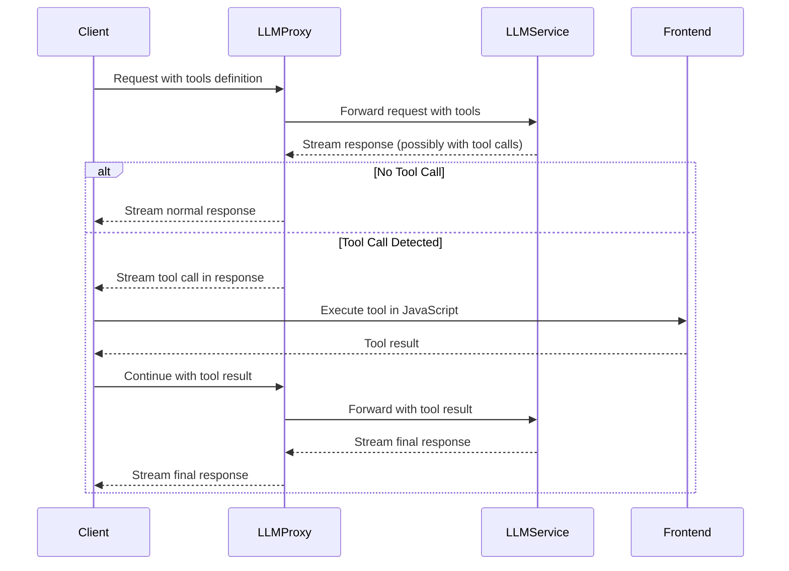

# LLM Function Calling Implementation Plan

## 1. Architecture Overview



## 2. Data Structure Changes

### 2.1. Extend the Completion Struct (lib.rs)

```rust
#[derive(Serialize, Deserialize, Debug, Clone)]
pub struct FunctionDefinition {
    pub name: String,
    pub description: String,
    pub parameters: serde_json::Value, // JSON Schema object
}

#[derive(Serialize, Deserialize, Debug, Clone)]
pub struct Tool {
    pub r#type: String, // "function"
    pub function: FunctionDefinition,
}

#[derive(Serialize, Deserialize, Debug, Clone)]
pub struct ToolCall {
    pub id: String,
    pub r#type: String, // "function"
    pub function: ToolCallFunction,
}

#[derive(Serialize, Deserialize, Debug, Clone)]
pub struct ToolCallFunction {
    pub name: String,
    pub arguments: String, // JSON string
}

#[derive(Serialize, Deserialize, Debug, Clone)]
pub struct ToolResult {
    pub tool_call_id: String,
    pub role: String, // "tool"
    pub name: String,
    pub content: String, // Result as string
}

// Extend the Message struct
#[derive(Serialize, Deserialize, Debug, Clone)]
pub struct Message {
    pub role: String,
    pub content: String,
    #[serde(skip_serializing_if = "Option::is_none")]
    pub tool_call_id: Option<String>,
    #[serde(skip_serializing_if = "Option::is_none")]
    pub tool_calls: Option<Vec<ToolCall>>,
    #[serde(skip_serializing_if = "Option::is_none")]
    pub name: Option<String>,
}

// Extend the Completion struct
#[derive(Serialize, Deserialize, Debug)]
pub struct Completion {
    pub model: String,
    #[serde(skip_serializing_if = "Option::is_none")]
    pub stream: Option<bool>,
    #[serde(skip_serializing_if = "Option::is_none")]
    pub max_tokens: Option<i32>,
    pub messages: Vec<Message>,
    #[serde(skip_serializing_if = "Option::is_none")]
    pub temperature: Option<f32>,
    #[serde(skip_serializing_if = "Option::is_none")]
    pub tools: Option<Vec<Tool>>,
    #[serde(skip_serializing_if = "Option::is_none")]
    pub tool_choice: Option<serde_json::Value>,
}
```

## 3. Implementation Steps

### 3.1. Create a Weather Function Definition (new file: function_tools.rs)

```rust
pub mod function_tools {
    use crate::{FunctionDefinition, Tool};
    use serde_json::{json, Value};

    pub fn get_weather_tool() -> Tool {
        Tool {
            r#type: "function".to_string(),
            function: FunctionDefinition {
                name: "get_weather".to_string(),
                description: "Get the current weather in a given location".to_string(),
                parameters: json!({
                    "type": "object",
                    "properties": {
                        "location": {
                            "type": "string",
                            "description": "The city and state, e.g. San Francisco, CA"
                        },
                        "unit": {
                            "type": "string",
                            "enum": ["celsius", "fahrenheit"],
                            "description": "The temperature unit to use"
                        }
                    },
                    "required": ["location"]
                }),
            },
        }
    }

    pub fn execute_weather_function(arguments: &str) -> Result<String, String> {
        let args: Value = serde_json::from_str(arguments)
            .map_err(|e| format!("Failed to parse arguments: {}", e))?;
        
        let location = args["location"]
            .as_str()
            .ok_or_else(|| "Location is required".to_string())?;
        
        let unit = args["unit"].as_str().unwrap_or("celsius");
        
        // Mock implementation - return fixed data
        let temp = if unit == "celsius" { 22 } else { 72 };
        let condition = "sunny";
        
        Ok(json!({
            "location": location,
            "temperature": temp,
            "unit": unit,
            "condition": condition,
            "forecast": ["sunny", "partly cloudy", "sunny"]
        }).to_string())
    }
}
```

### 3.2. Modify SSE Chat Enricher (sse_chat_enricher.rs)

```rust
// Add to GenerationEvent enum
pub enum GenerationEvent {
    Text(CompletionChunk),
    ToolCall(CompletionChunk),
    End(CompletionChunk),
}

// Modify enriched_chat function to detect tool calls
pub async fn enriched_chat(
    request: RequestBuilder,
    sender: mpsc::Sender<Result<GenerationEvent, Error>>,
    convert_errors_to_chat: bool,
) -> Result<(), Box<dyn std::error::Error>> {
    // ... existing code ...
    
    while let Some(event) = stream.next().await {
        match event {
            Ok(ReqwestEvent::Open) => tracing::debug!("Connection Open!"),
            Ok(ReqwestEvent::Message(message)) => {
                if message.data.trim() == "[DONE]" {
                    // ... existing code ...
                } else {
                    let m: Value = serde_json::from_str(&message.data)?;
                    
                    // Check for tool calls
                    if let Some(tool_calls) = m["choices"][0]["delta"]["tool_calls"].as_array() {
                        if !tool_calls.is_empty() {
                            snapshot.push_str(&message.data);
                            let chunk = CompletionChunk {
                                delta: message.data.clone(),
                                snapshot: snapshot.clone(),
                            };
                            if sender.send(Ok(GenerationEvent::ToolCall(chunk))).await.is_err() {
                                break;
                            }
                            continue;
                        }
                    }
                    
                    // Regular text content
                    if let Some(text) = m["choices"][0]["delta"]["content"].as_str() {
                        // ... existing code ...
                    }
                }
            }
            // ... existing error handling ...
        }
    }
    
    Ok(())
}
```

### 3.3. Modify API Chat Stream (api_chat_stream.rs)

```rust
// Modify the event_stream processing to handle tool calls
let event_stream = receiver_stream.then(move |item| {
    let pool = Arc::clone(&pool_arc);
    let api_key = Arc::clone(&api_key_arc);
    async move {
        match item {
            Ok(event) => match event {
                GenerationEvent::Text(completion_chunk) => {
                    Ok(Event::default().data(completion_chunk.delta))
                }
                GenerationEvent::ToolCall(completion_chunk) => {
                    // Pass through tool call events with the same format
                    Ok(Event::default().data(completion_chunk.delta))
                }
                GenerationEvent::End(completion_chunk) => {
                    log_end_of_chat(
                        pool,
                        &completion_chunk.snapshot,
                        &api_key,
                        api_chat_id,
                    )
                    .await
                    .unwrap();
                    Ok(Event::default().data(completion_chunk.delta))
                }
            },
            Err(e) => Err(axum::Error::new(e)),
        }
    }
});
```

### 3.4. Add Function Execution Logic (new file: function_executor.rs)

```rust
pub mod function_executor {
    use crate::function_tools;
    use crate::{Message, ToolCall};
    use serde_json::json;

    pub fn execute_tool_call(tool_call: &ToolCall) -> Result<Message, String> {
        match tool_call.function.name.as_str() {
            "get_weather" => {
                let result = function_tools::execute_weather_function(&tool_call.function.arguments)?;
                
                Ok(Message {
                    role: "tool".to_string(),
                    content: result,
                    tool_call_id: Some(tool_call.id.clone()),
                    name: Some("get_weather".to_string()),
                    tool_calls: None,
                })
            },
            _ => Err(format!("Unknown function: {}", tool_call.function.name)),
        }
    }
}
```

### 3.5. Modify the create_request Function (api_chat_stream.rs)

```rust
async fn create_request(
    transaction: &Transaction<'_>,
    api_key: String,
    completion: Completion,
) -> Result<(db::ApiKey, reqwest::RequestBuilder, i32), CustomError> {
    // ... existing code ...
    
    // Add weather tool if not already provided
    let mut completion = completion;
    if completion.tools.is_none() {
        completion.tools = Some(vec![function_tools::get_weather_tool()]);
    }
    
    // ... rest of the function ...
}
```

## 4. Frontend Integration

The frontend will need to be updated to handle tool calls in the SSE stream. Since we're keeping the same event structure, the frontend will receive tool calls as part of the normal stream. The frontend will need to:

1. Detect tool calls in the stream
2. Execute the appropriate JavaScript function
3. Send the result back to the backend

### 4.1. Frontend JavaScript Handler (conceptual)

```javascript
// This is a conceptual implementation for the frontend
function handleStreamEvent(event) {
    const data = JSON.parse(event.data);
    
    // Check if this is a tool call
    if (data.choices && 
        data.choices[0].delta && 
        data.choices[0].delta.tool_calls) {
        
        const toolCall = data.choices[0].delta.tool_calls[0];
        
        if (toolCall.function.name === "get_weather") {
            // Parse arguments
            const args = JSON.parse(toolCall.function.arguments);
            
            // Execute function
            const result = executeWeatherFunction(args);
            
            // Send result back to the backend
            sendToolResult(toolCall.id, "get_weather", result);
        }
    } else {
        // Handle normal text response
        displayMessage(data);
    }
}

function executeWeatherFunction(args) {
    // This would be implemented in the frontend
    console.log("Executing weather function with args:", args);
    return {
        location: args.location,
        temperature: 72,
        unit: args.unit || "fahrenheit",
        condition: "sunny"
    };
}

function sendToolResult(toolCallId, functionName, result) {
    // Send the result back to continue the conversation
    fetch('/v1/chat/completions', {
        method: 'POST',
        headers: {
            'Content-Type': 'application/json',
            'Authorization': 'Bearer ' + API_KEY
        },
        body: JSON.stringify({
            model: currentModel,
            messages: [
                ...previousMessages,
                {
                    role: "tool",
                    tool_call_id: toolCallId,
                    name: functionName,
                    content: JSON.stringify(result)
                }
            ]
        })
    });
}
```

## 5. Testing Plan

1. **Unit Tests**:
   - Test the weather function with various inputs
   - Test the tool call detection in the SSE stream
   - Test the message format with tool calls

2. **Integration Tests**:
   - Test the full flow from request to response with tool calls
   - Test error handling for invalid tool calls
   - Test with streaming and non-streaming responses

3. **Manual Testing**:
   - Test with a simple frontend that can execute the weather function
   - Verify the response format matches OpenAI's API
   - Test with different LLM providers that support function calling

## 6. Implementation Timeline

1. **Week 1**: Data structure changes and function definition
   - Extend the Completion and Message structs
   - Create the weather function definition
   - Add unit tests for the new structures

2. **Week 2**: Backend implementation
   - Modify the SSE enricher to detect tool calls
   - Implement the function executor
   - Update the API chat stream handler
   - Add integration tests

3. **Week 3**: Frontend integration and testing
   - Create a simple frontend demo
   - Test the full flow with the frontend
   - Fix any issues and refine the implementation

## 7. Future Enhancements

1. **Dynamic Function Registration**: Allow registering functions at runtime
2. **Function Authentication**: Add authentication for function calls
3. **Function Rate Limiting**: Limit the number of function calls
4. **Function Logging**: Log function calls for auditing
5. **Support for Multiple LLM Providers**: Ensure compatibility with different providers
6. **Advanced Error Handling**: Improve error handling for function calls