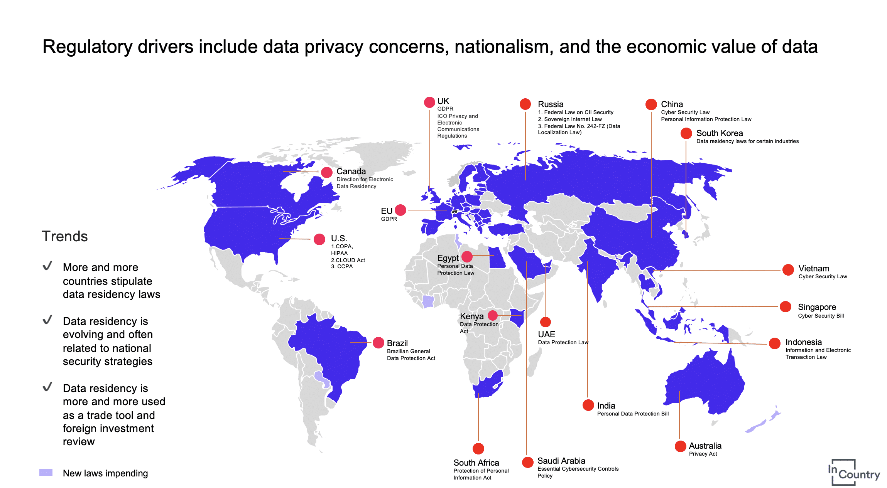
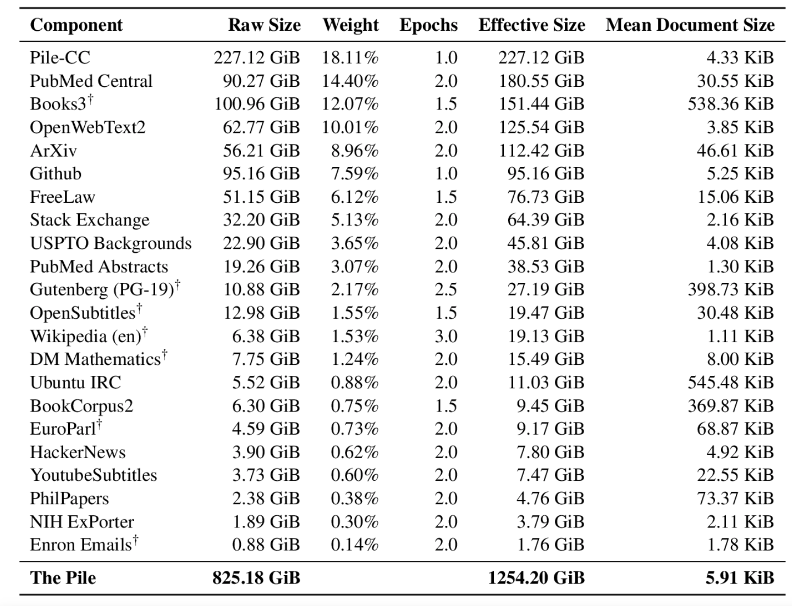
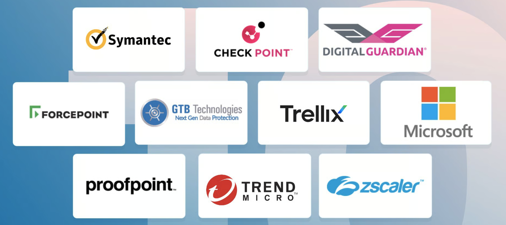
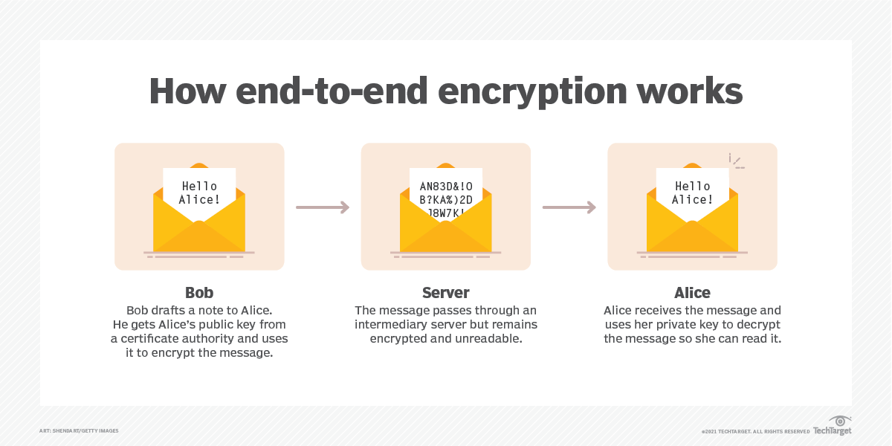

+++
title = "Why Companies are banning ChatGPT"
date = 2024-05-28
description = "Why Companies are banning ChatGPT"

[extra]
main_image = "blog/banning-chat-gpt/chat-gpt-banned.png"
listing_image = "blog/banning-chat-gpt/chat-gpt-banned.png"
author_image = "blog-authors/dio.jpeg"
author = "Kulbinder Dio"
+++

## Issue #1 Data Movement

The main issue with ChatGPT or any hosted system is that when you ask it a question you are actually **moving data from one place to another**.

Transferring data to ChatGPT can trigger various laws and regulations depending on the nature of the data, the industry, and the jurisdictions involved. Key areas of concern often include data protection, privacy, intellectual property, and corporate governance. Here are some of the main types of issues with data transfer.

1. **Data Protection and Privacy Laws:**
   - **General Data Protection Regulation (GDPR):** Applies to companies handling personal data of individuals in the European Union. It mandates strict data handling, transfer, and storage practices, and requires explicit consent for data transfers outside the EU.
   - **California Consumer Privacy Act (CCPA):** Similar to GDPR, it applies to businesses that collect personal data of California residents, providing them rights over their data and imposing restrictions on data transfers.
   - **Health Insurance Portability and Accountability Act (HIPAA):** In the U.S., HIPAA governs the handling of personal health information and is critical for companies in the healthcare sector.

2. **Intellectual Property (IP) Laws:**
   - **Trade Secret Laws:** Protects confidential business information that gives a company a competitive edge. Unauthorized disclosure can lead to significant legal repercussions.
   - **Copyright and Patent Laws:** Ensure that proprietary information, software, inventions, and creative works are not unlawfully distributed or used.

3. **Industry-Specific Regulations:**
   - **Financial Services Regulations:** Laws like the Gramm-Leach-Bliley Act (GLBA) and various SEC regulations in the U.S. govern the handling of financial data.
   - **Defence and Export Control Laws:** Such as the International Traffic in Arms Regulations (ITAR) and Export Administration Regulations (EAR) in the U.S., which control the export of defence related technology and information.

4. **Corporate Governance and Compliance:**
   - **Sarbanes-Oxley Act (SOX):** In the U.S., SOX imposes rigorous record-keeping and reporting requirements on public companies, including the safeguarding of financial information.
   - **The Dodd-Frank Act:** Also in the U.S., it includes provisions related to data security and whistleblower protection.

5. **Contractual Obligations:**
   - **Non-Disclosure Agreements (NDAs):** These agreements between parties can impose additional restrictions on sharing company data.
   - **Employment Contracts:** Often include clauses that restrict the sharing of company information.

6. **Cross-Border Data Transfers:**
   - **Privacy Shield Framework (now defunct):** Was a mechanism for complying with data protection requirements when transferring personal data from the EU to the U.S.
   - **Standard Contractual Clauses (SCCs):** Currently used for data transfers out of the EU in the absence of an adequacy decision.

#### Consequences of Non-Compliance

Failure to comply with these laws can result in severe penalties, including:
   - **Fines and Penalties:** GDPR can impose fines up to 4% of global annual revenue or €20 million, whichever is higher. HIPAA and CCPA also have substantial penalties.
   - **Lawsuits:** Non-compliance can lead to litigation from affected parties, including class-action lawsuits.
   - **Reputational Damage:** Breaches and non-compliance can damage a company's reputation and customer trust.

### Dark Data and Accidental Data Sending

Compounding the issue is that a lot of companies do not know what there data is or its classification

## Issue #2 Responses

1. Using copyright

## Side effects of Chat GPT Bans

1. **Shadow IT** In companies that have banned ChatGPT, shadow IT is becoming a concern as employees find unauthorized workarounds. This practice risks data breaches, compliance violations, and security vulnerabilities, as employees might use personal devices or external networks to access ChatGPT.

1. Repetition

## Approaches to Solving the Issue

### Deploying Solutions on Premise

By installing a ChatGPT replacement that runs on premise in the companies private network a lot of the issues with data movement go away.

### Using models trained on Open Source Data

### Data Leakage Prevention Solutions

### Guardrails

In the context of general artificial intelligence (GenAI), "guardrails" are essential mechanisms and guidelines to ensure AI systems operate safely, ethically, and reliably. Key aspects include:

1. **Ethical Guidelines**: Ensuring transparency, fairness, accountability, and privacy in AI operations to align with human values.

2. **Regulatory Frameworks**: Adhering to laws, standards, and best practices, such as those from ISO or IEEE, to ensure compliance and ethical deployment.

3. **Technical Safeguards**: Building robust, secure, and explainable AI systems that include human-in-the-loop mechanisms to allow human intervention when necessary.

4. **Societal Considerations**: Promoting inclusivity and public engagement to ensure AI serves diverse demographic needs and fosters trust.

These guardrails manage the balance between technological advancements and societal impact, aiming to harness GenAI's benefits while minimizing potential harms.

### End to End Encryption

End-to-end encryption (E2EE) could significantly enhance ChatGPT's handling of data privacy and security issues. By encrypting data at the source and ensuring it remains encrypted until it reaches the intended recipient, E2EE protects user interactions from unauthorized access, interception, and tampering. 

This is still in the very early stages but some promising research is available.

- [Securing ChatGPT & LLMs with End-to-end Encryption](https://www.fhenix.io/securing-chatgpt-llms-with-end-to-end-encryption/)
- [Making ChatGPT Encrypted End-to-end](https://www.zama.ai/post/chatgpt-privacy-with-homomorphic-encryption)

## Conclusion

How to we combine all the approaches above into a combined solution.