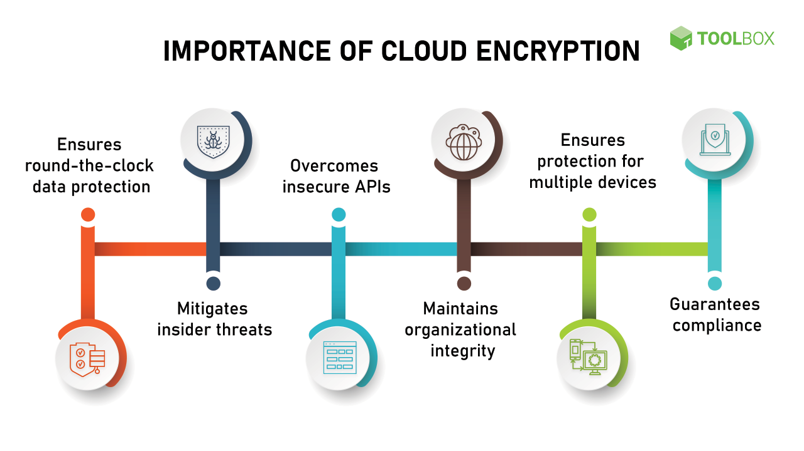
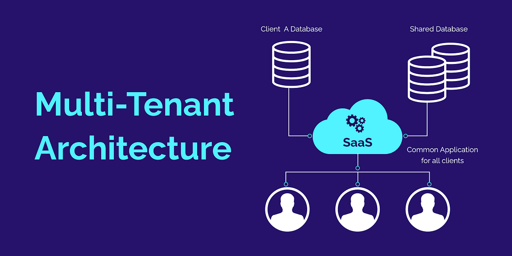
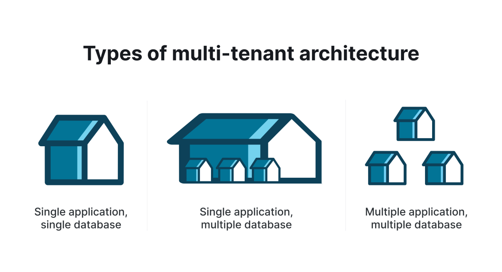
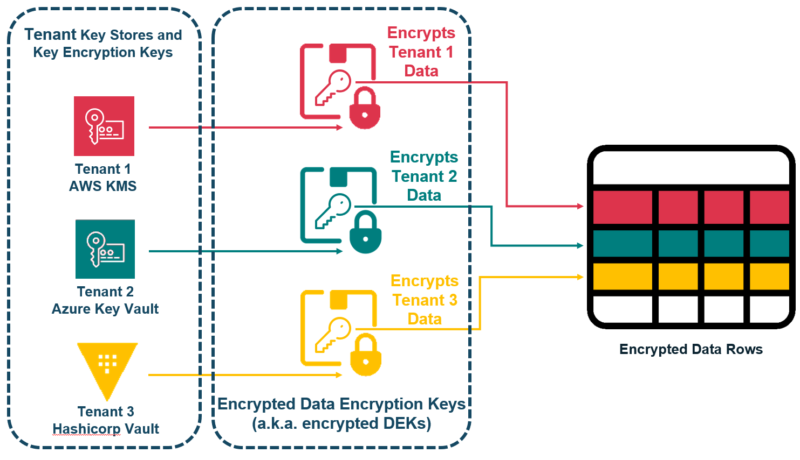
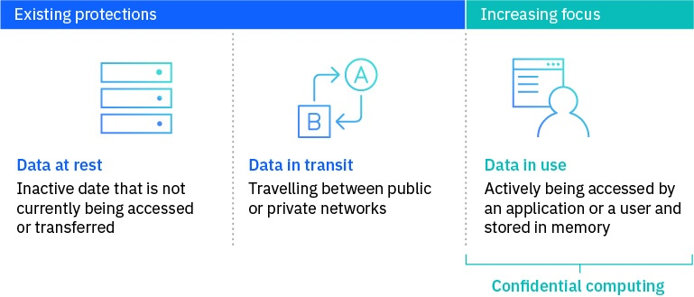
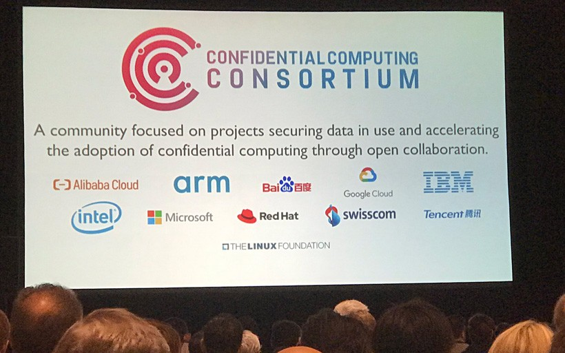

+++
title = "Building SaaS applications for highly regulated industries using Confidential Computing"
date = 2024-07-11
description = "Building SaaS applications for highly regulated industries using Confidential Computing"

[extra]
main_image = "blog/confidential-saas/kubernetes.png"
listing_image = "blog/confidential-saas/kubernetes.png"
author_image = "blog-authors/dio.jpeg"
author = "Kulbinder Dio"
+++

Enterprises prefer B2B SaaS solutions over on premise solutions because they offer:

- A cost-effective way to streamline business operations 
- Scalability to meet changing business needs 
- Flexibility to adapt to evolving business requirements 
- Avoidance of upfront capital expenditures 
- Reduced IT burdens 
- Automatic software updates, freeing up resources for core business activities

Despite the advantages of SaaS, **not all enterprise software has transitioned to the cloud**. Legacy systems, complex integrations, and **sensitive data concerns** can make migration challenging. Some industries, such as finance and healthcare, have strict regulations and security requirements that may necessitate on-premise solutions.

## Defence in Depth for Regulated Data

In this article we'll cover some Defence in Depth best practices along with the emerging availability of Secure Compute to show how even more Enterprise Applications can move to a SaaS model.



We'll cover the following

- **Multi tenancy** best practices and implementation options.
- **Bring Your Own Key BYOK** and encryption at rest.
- **What is Confidential Computing** and how can we use it.
- **Attestation** of cloud infrastructure
- How **Deterministic builds** promote trust.

## Multi Tenancy 

What is Multi-Tenancy?

Multi-tenancy is a software architecture that allows a single instance of a software application to serve multiple customers, or "tenants", simultaneously. Each tenant's data is isolated from others, and the application provides a separate and secure environment for each tenant.



Why is Multi-Tenancy Important for SaaS Applications?

In a SaaS (Software as a Service) model, multiple customers (tenants) use the same application, and multi-tenancy is crucial to ensure:

- Data Isolation: Each tenant's data is separated from others, ensuring confidentiality, integrity, and compliance with regulatory requirements.
- Scalability: A single instance of the application can serve multiple tenants, making it more efficient and cost-effective.
- Customization: Tenants can have their own configurations, branding, and feature sets without affecting other tenants.
- Security: Multi-tenancy ensures that a security breach in one tenant's environment does not compromise others.

### Types of Multi-Tenancy

There are three main types of multi-tenancy:



- Separate Databases: Each tenant has its own database, which provides maximum isolation but can be resource-intensive.
- Shared Database, Separate Schemas: Tenants share a database but have separate schemas, which provides a balance between isolation and resource efficiency.
- Shared Database, Shared Schema: Tenants share a database and schema, which is the most resource-efficient but may compromise data isolation.

### How we implement Multi Tenancy

We actually use a shared database for our cloud customers on the free plan. For paying customers we have the option to use namespaces in our kubernetes cluster or customers can create their own clusters on premise or in their own private cloud.

The implementation is helped by the way Kubernetes works

1. We have a Kubernetes Operator that given a config file will create a Bionic GPT deployment in a namespace.
1. Each namespace has its own Postgres database using [Cloud Native PG](https://cloudnative-pg.io/)
1. We apply a network security policy in the cluster to lock down each namespace.

The Kubernetes Operator handles upgrades of the application. The code for the operator is [available on Github](https://github.com/bionic-gpt/bionic-gpt/tree/main/crates/k8s-operator)

## Bring Your Own Key and Encryption at Rest

BYOK (Bring Your Own Key) is a cloud security model that allows customers to manage and maintain control over their own encryption keys, rather than relying on the cloud provider's keys, to protect their data in the cloud.



BYOK stands for "Bring Your Own Key," which is an important concept in cloud computing and data encryption. Here's why BYOK is important:

1. Data Security: BYOK allows organizations to maintain control over their encryption keys, which are used to protect sensitive data in the cloud. This ensures that even the cloud provider doesn't have access to the encrypted data, reducing the risk of unauthorized access.
1. Compliance: Many regulatory requirements, such as HIPAA, PCI-DSS, and GDPR, mandate that organizations maintain control over their encryption keys. BYOK helps organizations comply with these regulations and avoid potential penalties.
1. Key Management: BYOK enables organizations to manage their encryption keys centrally, which is essential for key rotation, revocation, and auditing. This ensures that encryption keys are properly managed and secured.
1. Multi-Cloud Strategy: With BYOK, organizations can use the same encryption keys across multiple cloud providers, making it easier to adopt a multi-cloud strategy without worrying about key management inconsistencies.
1. Reduced Risk of Insider Threats: BYOK reduces the risk of insider threats, as even cloud provider personnel won't have access to the encryption keys.
1. Customizable Security: BYOK allows organizations to choose their own encryption algorithms, key lengths, and management practices, giving them more control over their data security.
1. Vendor Lock-In Prevention: BYOK prevents cloud providers from locking organizations into their proprietary encryption schemes, making it easier to switch providers if needed.
1. Cost Savings: BYOK can help organizations avoid the costs associated with cloud providers' proprietary encryption services.
1. Improved Data Sovereignty: BYOK ensures that organizations maintain control over their data, even when it's stored in the cloud, which is essential for organizations with sensitive data.
1. Peace of Mind: BYOK provides organizations with greater confidence in the security of their data, as they maintain control over the encryption keys and can ensure that their data is properly protected.

In summary, BYOK is important because it allows organizations to maintain control over their encryption keys, ensuring data security, compliance, and peace of mind in the cloud.

### How we handle BYOK and Encryption at Rest

## Confidential Computing


Confidential computing is a technology that enables secure data processing and analysis on sensitive data while it remains encrypted. This means that even the party performing the computation (e.g., a cloud provider) cannot access or view the data in plaintext, ensuring the confidentiality and integrity of the data.



### Key Features:

- Encryption in use: Data remains encrypted throughout the entire processing cycle, including when it's being computed on.
- Private computation: Computation is performed on encrypted data, without decrypting it first.
- Secure enclaves: Computation takes place within a secure, isolated environment (e.g., Trusted Execution Environment (TEE) or Secure Enclave) that protects the data and the computation process.

### Benefits:

- Enhanced data security: Protects sensitive data from unauthorized access, even from cloud providers or insiders.
- Increased trust: Enables organizations to share sensitive data with third-party service providers or collaborators while maintaining control and confidentiality.
- Compliance: Helps organizations meet regulatory requirements and industry standards for data protection.

### Technologies:

- Intel SGX (Software Guard Extensions): Provides a hardware-based secure enclave for confidential computing.
- AMD SEV (Secure Encrypted Virtualisation): Offers a secure environment for confidential computing.
- Google Cloud Confidential Computing: A cloud-based confidential computing platform.

### Confidential Computing Availability

Confidential Compute is available on most cloud providers and is also available for bare metal installations. More details can be found with the [Confidential Computing Consortium – Linux Foundation Project](https://confidentialcomputing.io/) 



### How we have implemented Confidential Compute

For our cloud solution we are running on Google Cloud [GKE](https://cloud.google.com/kubernetes-engine?hl=en).

To turn on Confidential Compute is as easy as passing one parameter to the CLI when creating a cluster.

```sh
gcloud container clusters create bionic 
    --zone us-west1-b --machine-type n2d-standard-2 
    --enable-confidential-nodes
```

It's really that easy.

## Deterministic Builds and Github

The process ensures that given the same source code, environment, and build instructions, the resulting binary will be identical. This involves controlling all factors that can affect the build output, such as timestamps, file ordering, and system-specific details.

2. **Security and Verification**: Repeatable builds enhance security by making it easier to detect and prevent malicious modifications. Developers and users can verify that the binary code they are running matches the source code, ensuring that no unauthorized changes have been introduced.
3. **Collaboration and Trust**: In open-source projects, repeatable builds foster trust among contributors and users. They allow multiple parties to independently verify the integrity of the software, enhancing collaboration and reducing the risk of supply chain attacks.
4. **Build Environment**: Achieving repeatable builds often requires careful management of the build environment, including the use of containerization or virtualisation to isolate the build process from external influences.
5. **Documentation and Tools**: Detailed documentation of the build process and tools designed to facilitate repeatable builds, such as `reproducible-builds.org`, help developers implement and maintain this practice across different projects and ecosystems.

## Attestation

## Conclusion

In conclusion, building SaaS applications for highly regulated industries requires a deep understanding of the security and compliance requirements that come with handling sensitive data. Key takeaways include:

- Implementing Defence in Depth best practices, such as multi-tenancy, to ensure data isolation and scalability 
- Using Bring Your Own Key (BYOK) encryption to maintain control over encryption keys and ensure data security 
- Leveraging Confidential Computing to protect data in use and provide an additional layer of security 
- Implementing deterministic builds to ensure repeatable and verifiable build processes that can be tied back to the original source code for verification and trust
- Utilizing attestation and Secure Compute to provide an added layer of security and trust 