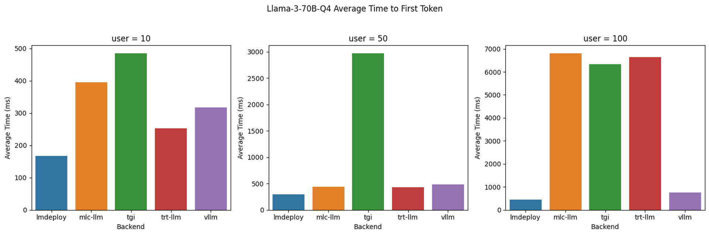
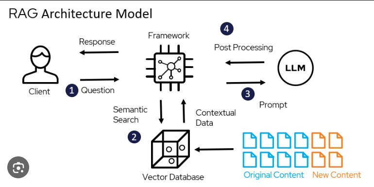

+++
title = "Model Denial of Service prevention for  production LLM applications"
date = 2024-04-10
description = "How to prevent model denial of service for production LLM applications."

[extra]
main_image = "blog/model-denial-of-service/model-denial-of-service.png"
listing_image = "blog/model-denial-of-service/model-denial-of-service.png"
author_image = "blog-authors/ian-purton.jpeg"
author = "Ian Purton"
+++

## What is Model Denial of Service?

Denial of Service (DoS) on large language models (LLMs) and other machine learning (ML) systems can disrupt normal operations or degrade performance. These attacks can take various forms, each exploiting different aspects of the model's functionality or its supporting infrastructure. [Model Denial of Service](https://genai.owasp.org/llmrisk/llm04-model-denial-of-service/) is on the Owasp Top 10 List for LLM and Generative AI applications.

Note: We call them *attacks* but **often these can be unintentional** i.e. a script left running overnight or just normal day to day usage.

Here are some of the types of DoS. 

1. Adversarial Example Attacks
**Perturbation Attacks:** Small, crafted changes to inputs can mislead the model into incorrect outputs, increasing computational load.

2. Resource Exhaustion Attacks
**Query Flooding:** Sending a high volume of queries overwhelms the model's processing capacity.

3. Algorithmic Complexity Attacks
**Input Crafting for High Complexity:** Designing inputs to exploit worst-case performance characteristics can significantly slow down the model.

4. Data Poisoning Attacks
**Injecting Malicious Data:** Introducing bad data into the training set causes long-term performance degradation.

5. Model Overload Attacks
**Concurrent Query Flooding:** Overloading the model with simultaneous queries from multiple sources exceeds its capacity for handling concurrent processes.

6. Infrastructure Attacks
**Network Saturation:** Saturating the network bandwidth of the model's server infrastructure disrupts service.

## Resource Exhaustion

In this article we'll focus on Resource Exhaustion as its the most likely DoS that you'll see in a Gen AI Application.

[Benchmarking LLM Inference Backends](https://www.bentoml.com/blog/benchmarking-llm-inference-backends)

### LLMs are Memory Bound

## We need to take care of 2 scenarios

### 1. High Volume of Queries

A high volume of queries to a large language model (LLM) can significantly strain its computational resources, leading to performance degradation and potential unavailability. 

This makes sense and is the same problem for any API that gets deployed into production.

### 2. Large Prompt and Response Sizes

LLMs have an additional problem that is not often seen with other API endpoints. A single call to an LLM can be large, especially in the case of Retrieval Augmented Generation where the **prompt may contain whole documents**.

This puts extra strain on the Inference Engine.

It also works both ways. Ask an LLM to write a __10,000 word essay__ and although the initial prompt is small the LLM will need to generate thousands of tokens.

So we need a way to limit query volumes and sizes and still give our users the best results.

## Prevention using a Gateway or Reverse Proxy

### Token Buckets

### What's out there

#### LLM-Lite

#### Envoy, Kong and Other API Gateways